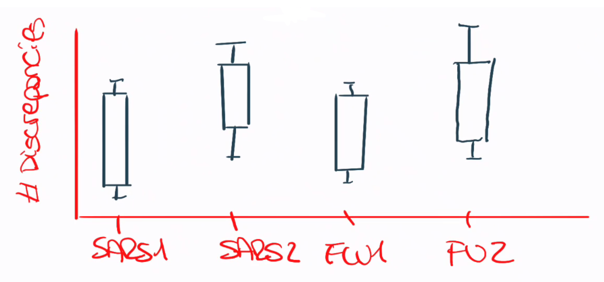
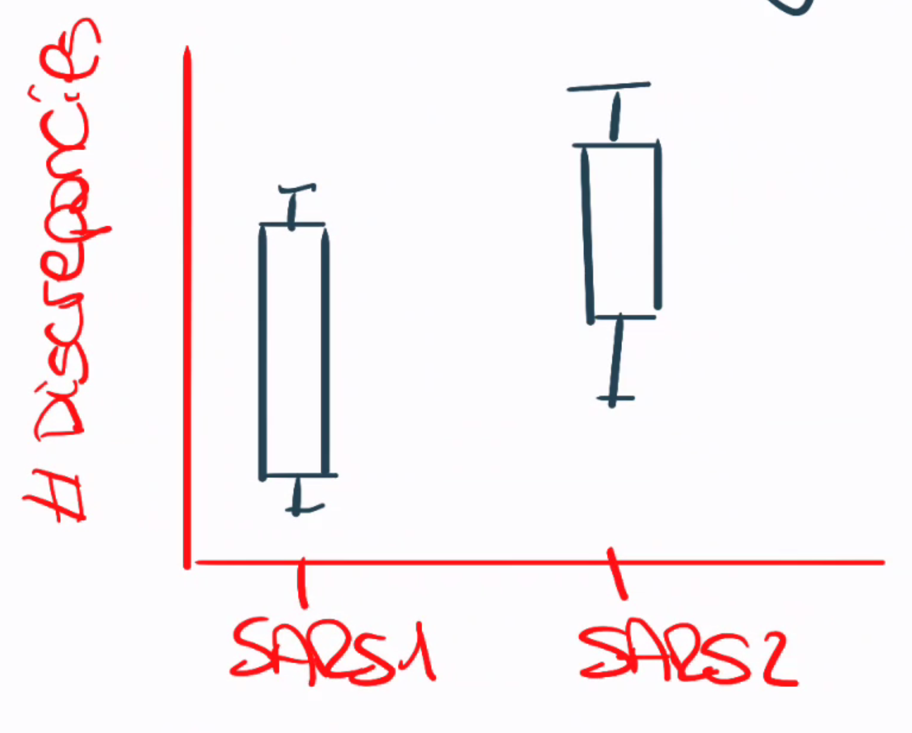
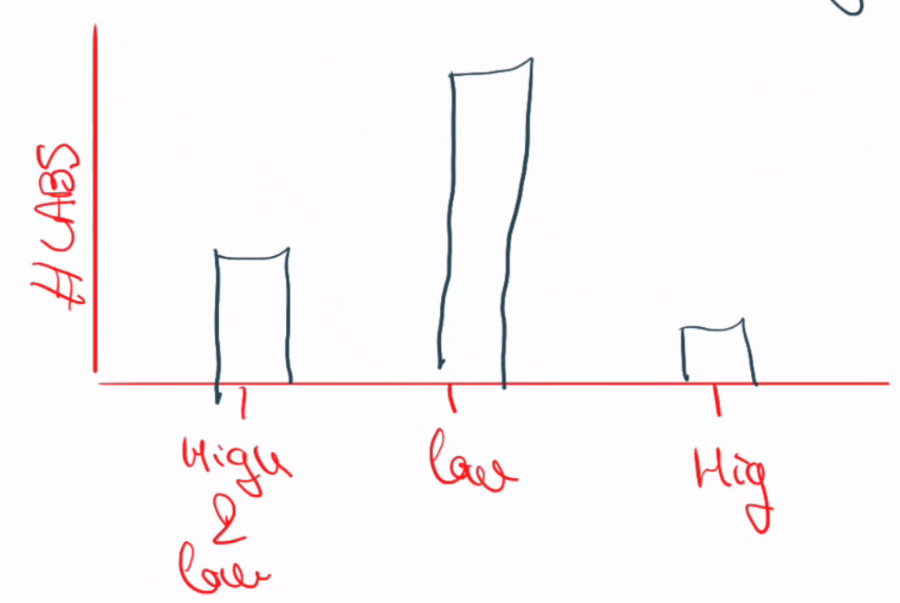
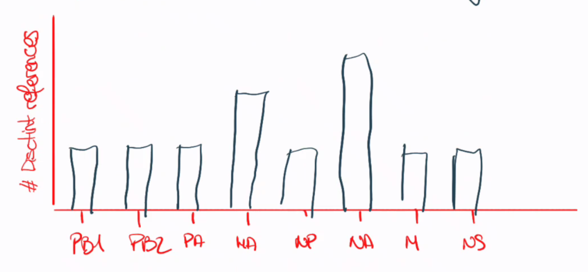
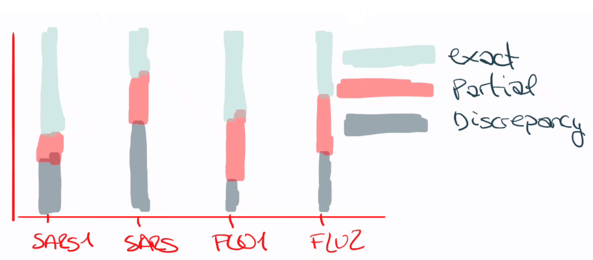
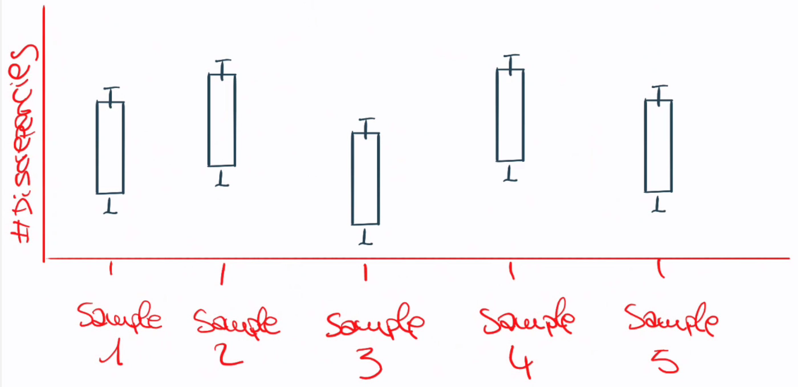

{# =========================
  JINJA2 TEMPLATE: RELECOV EQA REPORT
  Context expected:
    - general: dict (from general.json)
    - labdata: dict (from lab_<LAB_COD>.json)
========================= #}

{# ---------- Helpers / macros ---------- #}

  {{ "%.{}f".format(decimals)|format(x) }}%


  
    <figure>
      
      <figcaption>{{ caption }}</figcaption>
    </figure>
  





# RELECOV 2.0 - Consolidation of WGS and RT-PCR activities for SARS-CoV-2 in Spain towards sustainable use and integration of enhanced infrastructure and capacities in the RELECOV network

##### Sarai Varona, Enrique Sapena, Pablo Mata, Alejandro Bernabéu, Pau Pascual, Magdalena Matito, Juan Ledesma, Sara Monzón, Isabel Cuesta

## Table of Contents

- [RELECOV 2.0 - Consolidation of WGS and RT-PCR activities for SARS-CoV-2 in Spain towards sustainable use and integration of enhanced infrastructure and capacities in the RELECOV network](#relecov-20---consolidation-of-wgs-and-rt-pcr-activities-for-sars-cov-2-in-spain-towards-sustainable-use-and-integration-of-enhanced-infrastructure-and-capacities-in-the-relecov-network)
        - [Sarai Varona, Enrique Sapena, Pablo Mata, Alejandro Bernabéu, Pau Pascual, Magdalena Matito, Juan Ledesma, Sara Monzón, Isabel Cuesta](#sarai-varona-enrique-sapena-pablo-mata-alejandro-bernabéu-pau-pascual-magdalena-matito-juan-ledesma-sara-monzón-isabel-cuesta)
  - [Table of Contents](#table-of-contents)
  - [Executive Summary](#executive-summary)
  - [1. Introduction](#1-introduction)
  - [2. Scope of the EQA](#2-scope-of-the-eqa)
  - [3. Dataset Design and Sample Selection Criteria](#3-dataset-design-and-sample-selection-criteria)
    - [3.1. Rationale for Dataset Selection](#31-rationale-for-dataset-selection)
    - [3.2. SARS-CoV-2 Dataset Selection](#32-sars-cov-2-dataset-selection)
    - [3.3. Influenza Dataset Selection](#33-influenza-dataset-selection)
      - [In-Silico Influenza Dataset Construction](#in-silico-influenza-dataset-construction)
  - [4. Methodology of Evaluation](#4-methodology-of-evaluation)
    - [4.1. Submission Completeness](#41-submission-completeness)
    - [4.2. Evaluation of Consensus Genome Reconstruction Performance](#42-evaluation-of-consensus-genome-reconstruction-performance)
    - [4.3. Evaluation of Variant Detection Accuracy](#43-evaluation-of-variant-detection-accuracy)
      - [4.3.1. SARS-CoV-2](#431-sars-cov-2)
      - [4.3.2. Influenza](#432-influenza)
    - [4.4. Evaluation of Lineage, Subtype and Clade Assignment](#44-evaluation-of-lineage-subtype-and-clade-assignment)
      - [SARS-CoV-2](#sars-cov-2)
      - [Influenza virus](#influenza-virus)
      - [Both viruses](#both-viruses)
    - [4.5. Evaluation of Metadata Completeness and Compliance](#45-evaluation-of-metadata-completeness-and-compliance)
      - [Evaluation of Sample Quality Control Assessment](#evaluation-of-sample-quality-control-assessment)
    - [4.6. Pipeline Benchmarking and Comparative Performance](#46-pipeline-benchmarking-and-comparative-performance)
  - [5. General Results](#5-general-results)
    - [5.1. Submission Completeness](#51-submission-completeness)
    - [5.2. Consensus Genome Reconstruction Performance](#52-consensus-genome-reconstruction-performance)
    - [5.3. Variant Detection Accuracy](#53-variant-detection-accuracy)
      - [5.3.1. SARS-CoV-2](#531-sars-cov-2)
      - [5.3.2. Influenza virus](#532-influenza-virus)
    - [5.4. Lineage, Subtype and Clade Assignment](#54-lineage-subtype-and-clade-assignment)
    - [5.5. Metadata completeness and compliance](#55-metadata-completeness-and-compliance)
      - [Overall Completeness](#overall-completeness)
      - [Reporting of Analytical Parameters](#reporting-of-analytical-parameters)
      - [Controlled Vocabulary Compliance](#controlled-vocabulary-compliance)
      - [Sample Quality Control Assessment](#sample-quality-control-assessment)
    - [5.6. Pipeline Benchmarking and Comparative Performance](#56-pipeline-benchmarking-and-comparative-performance)
      - [Diversity of Analytical Workflows](#diversity-of-analytical-workflows)
  - [6. Component-specific Results](#6-component-specific-results)
    - [6.{{ loop.index }}. {{ comp\_code }} ({{ comp\_net.name }})](#6-loopindex---comp_code---comp_netname-)
      - [6.{{ loop.index }}.1. Participation and Submissions](#6-loopindex-1-participation-and-submissions)
      - [6.{{ loop.index }}.2. Consensus Genome Reconstruction Performance](#6-loopindex-2-consensus-genome-reconstruction-performance)
      - [6.{{ loop.index }}.3. Variant Detection Accuracy](#6-loopindex-3-variant-detection-accuracy)
      - [6.{{ loop.index }}.4. Lineage, Subtype and Clade Assignment](#6-loopindex-4-lineage-subtype-and-clade-assignment)
      - [6.{{ loop.index }}.5. Sample Quality Control Assessment](#6-loopindex-5-sample-quality-control-assessment)
      - [6.{{ loop.index }}.6. Pipeline Benchmarking and Comparative Performance](#6-loopindex-6-pipeline-benchmarking-and-comparative-performance)
  - [7. Discussion](#7-discussion)
    - [7.1. Overall Analytical Robustness](#71-overall-analytical-robustness)
    - [7.2. Variant Detection Accuracy](#72-variant-detection-accuracy)
    - [7.3. Classification Accuracy and Database Versioning](#73-classification-accuracy-and-database-versioning)
    - [7.4. Workflow Diversity and Standardisation Balance](#74-workflow-diversity-and-standardisation-balance)
    - [7.5. Implications for RELECOV 2.0](#75-implications-for-relecov-20)
  - [8. Conclusions](#8-conclusions)
- [9. Individual Laboratory Technical Report](#9-individual-laboratory-technical-report)
  - [Laboratory: {{ labdata.lab.laboratory\_name }} ({{ labdata.lab.lab\_cod }})](#laboratory--labdatalablaboratory_name---labdatalablab_cod-)
  - [9.1. Participation Overview](#91-participation-overview)
- [9.{{ loop.index + 1 }}. {{ comp\_code }} ({{ comp.display\_name }})](#9-loopindex--1---comp_code---compdisplay_name-)
  - [9.{{ loop.index + 1 }}.1. Consensus Genome Reconstruction Performance](#9-loopindex--1-1-consensus-genome-reconstruction-performance)
    - [Per-sample summary metrics](#per-sample-summary-metrics)
    - [Discrepancy type breakdown per sample](#discrepancy-type-breakdown-per-sample)
  - [9.{{ loop.index + 1 }}.2. Variant Detection Performance](#9-loopindex--1-2-variant-detection-performance)
  - [9.{{ loop.index + 1 }}.3. Lineage, Subtype and Clade Assignment](#9-loopindex--1-3-lineage-subtype-and-clade-assignment)
    - [Classification error counts](#classification-error-counts)
  - [9.{{ loop.index + 1 }}.4. Pipeline Benchmarking and Comparative Performance](#9-loopindex--1-4-pipeline-benchmarking-and-comparative-performance)
  - [9.{{ loop.index + 1 }}.5. Metadata-Derived Analytical Metrics (per sample)](#9-loopindex--1-5-metadata-derived-analytical-metrics-per-sample)
      - [Sample Quality Control Assessment](#sample-quality-control-assessment-1)
      - [Other metrics](#other-metrics)
    - [{{ sample\_id }}](#-collecting_lab_sample_id-)
  - [Acknowledgement](#acknowledgement)

## Executive Summary

To be completed after final results are consolidated.

This EQA provides the first fully drylab benchmarking of bioinformatic workflows across the RELECOV network, integrating both internationally validated datasets and purpose-designed in-silico scenarios.

## 1. Introduction

The RELECOV Network aims to strengthen genomic surveillance of respiratory viruses by developing and harmonising analytical capacities across the participating laboratories. In this context, it is essential to **assess the consistency, reproducibility and maturity of the bioinformatics workflows implemented within the network**.

To this end, an **external quality assessment (EQA) exercise in dry lab format** will be conducted, inspired by the ECDC’s 2024 dry-lab EQA. The exercise will focus on the bioinformatic characterisation of respiratory viruses, testing key analytical tasks including viral genome reconstruction, variant identification, and lineage and clade assignment.

A central component of this initiative is to evaluate the range of analytical pipelines currently used in Relecov Network, identify their relative performance, and determine which pipeline is best suited for establishing a genomic surveillance standard within the network. This evaluation directly contributes to **Objective 3** of RELECOV 2.0, which focuses on *generating a comprehensive understanding of the analytical and operational workflows currently implemented across Spanish laboratories*. Furthermore, the EQA provides the practical evidence base required for Task T6.1, which aims to identify, compare and prioritise the analytical pipelines available nationally in order to define the workflow that should be integrated into the RELECOV analytical platform.

The exercise is also aligned with **Milestone M3.2**, which pertains to the *establishment of harmonised analytical procedures for respiratory viruses*. It also contributes to **Deliverable D4.1**, focused on the definition of minimum metadata requirements and harmonised reporting formats, by *testing the ability of laboratories to produce interoperable outputs suitable for integration into national and international surveillance systems*. In addition, the exercise informs the development of the RELECOV platform by providing operational insights critical to **Task T5.2**, which addresses *data ingestion, workflow automation and technical specifications for integrating pipeline outputs within the platform*.

Beyond workflow harmonisation, the EQA contributes to capacity-building and performance assessment activities central to the project. By benchmarking analytical performance across laboratories, the exercise provides essential input for **Milestone M6.3**, related to *determining laboratory readiness and identifying areas requiring technical reinforcement or training*. These insights also support **Deliverable D6.2**, which includes *recommendations for strengthening network-wide analytical capacity and ensuring long-term sustainability of genomic surveillance operations*.

The overall objective of the exercise is to **assess the bioinformatic performance of the participating laboratories, identify areas for improvement, and promote the adoption of consistent and comparable analytical practices across the network**. The outcomes will enhance RELECOV’s preparedness and response capacity in routine surveillance and public health emergencies, ensuring the quality and robustness of genomic analyses performed throughout the network and contributing directly to the fulfilment of key project objectives, milestones and deliverables.

## 2. Scope of the EQA

The 2026 RELECOV Dry-Lab External Quality Assessment (EQA) was designed to evaluate the bioinformatic analytical performance of laboratories participating in the RELECOV Network in the context of respiratory virus genomic surveillance.

Participating laboratories were provided with raw sequencing datasets corresponding to four independent analytical components:

- **SARS1**: Five SARS-CoV-2 samples sequenced using paired-end Illumina technology from the 2024 ECDC ESIB EQA
- **SARS2**: Five SARS-CoV-2 samples sequenced using Oxford Nanopore Technologies from the 2024 ECDC ESIB EQA
- **FLU1**: Five influenza virus samples sequenced using paired-end Illumina technology, 3 generated in-silico and 2 from the 2024 ECDC ESIB EQA.
- **FLU2**: Five influenza virus samples sequenced using Oxford Nanopore Technologies, 3 generated in-silico and 2 from the 2024 ECDC ESIB EQA.

Datasets were distributed as raw sequencing reads (.fastq files), and laboratories were free to analyse any subset of components according to their technical capacity and routine workflow.
Laboratories were requested to submit:

- For each analysed sample:
  - One consensus genome sequence in .fasta format, containing exclusively the target viral genome reconstructed from the provided reads.
  - One or more variant call files in .vcf format, listing detected nucleotide variants relative to the reference genome selected by the laboratory.
- A completed harmonised metadata template, documenting analytical tools, software versions, reference genomes used, parameter settings, coverage thresholds, Lineage, Subtype or clade assignment tools, and file paths to submitted outputs.

The primary objective of the exercise was to assess the consistency, reproducibility, and comparability of bioinformatic workflows currently implemented across the network. The evaluation focused on core analytical tasks that are essential for routine genomic surveillance and public health response, including:

- **Viral genome reconstruction**: Generation of high-quality consensus genome sequences from raw sequencing reads produced using Illumina and Oxford Nanopore Technologies platforms.
- **Variant identification and reporting**: Detection and annotation of nucleotide variants relative to a chosen reference genome, including evaluation of filtering criteria, allele frequency thresholds, and variant file standardisation.
- **Lineage, Subtype and clade assignment**: Accurate classification of reconstructed genomes using established nomenclature systems and version-controlled databases.
- **Metadata reporting and interoperability**: Completion of a harmonised metadata template capturing software versions, analytical parameters, reference genome selection, and file traceability, ensuring compatibility with automated validation and integration into the RELECOV analytical platform.

## 3. Dataset Design and Sample Selection Criteria

### 3.1. Rationale for Dataset Selection

The 2026 RELECOV Dry-Lab EQA was specifically designed for laboratories operating in a clinical and hospital-based diagnostic context, where routine genomic surveillance primarily involves human respiratory samples.

Sample selection followed three guiding principles:

- Representation of realistic genomic surveillance scenarios.
- Inclusion of defined analytical challenges.
- Ensuring methodological benchmarking robustness.

Datasets were derived from two sources:

- Reused datasets from the 2024 ECDC ESIB Dry-Lab EQA.
- Newly generated in-silico datasets constructed to simulate seasonal human influenza circulation.

The integration of both sources allowed alignment with internationally validated materials while tailoring the exercise to the operational reality of RELECOV clinical laboratories.

### 3.2. SARS-CoV-2 Dataset Selection

SARS-CoV-2 datasets were selected from the 2024 ECDC ESIB EQA to ensure comparability with internationally benchmarked material. Both Illumina and Nanopore panels included samples representing:

- High-quality baseline genomes.
- Low read-depth scenarios.
- Samples with numerous mixed sites.
- Contamination with non-target viral reads.
- Lineages of epidemiological relevance (e.g., recombinant or XBB-related lineages).

Only samples generated using the same ARTIC primer scheme (v4.1) were selected to avoid introducing variability associated with enrichment panel differences. This ensured that observed performance differences reflect analytical workflow characteristics rather than primer design heterogeneity.



Table {{ table_counter.value }} summarises the correspondence between RELECOV EQA samples and their original source datasets, including ECDC ESIB references.

_**Table {{ table_counter.value }}**. Overview of SARS-CoV-2 datasets used in the RELECOV 2026 Dry-Lab EQA.
The table details sample origin, sequencing technology (Illumina paired-end or Oxford Nanopore Technologies), amplicon primer scheme version, and specific analytical characteristics intentionally selected to assess workflow robustness under challenging conditions._

| Sample | Source             | Platform | Amplicon primers version | Ref sample | Key Feature                                       | FASTQ files | Read layout | Clade Assignment | Lineage Assignment | Quality check |
|--------|--------------------|----------|--------------------------|------------|---------------------------------------------------|-------------|-------------|------------------|--------------------|---------------|
| SARS1  | ECDC-ESIB EQA 2024 | Illumina | ARTIC v4.1               | SARS2.04   | Influenza virus sample with some SARS-CoV-2 reads | 2           | Paired-end  | Unable to align  | Unassigned         | Bad           |
| SARS2  | ECDC-ESIB EQA 2024 | Illumina | ARTIC v4.1               | SARS2.01   | High-quality baseline sample                      | 2           | Paired-end  | outgroup (BA.1)  | BA.1.13            | Ok            |
| SARS3  | ECDC-ESIB EQA 2024 | Illumina | ARTIC v4.1               | SARS2.16   | XBB sample / insertion challenge                  | 2           | Paired-end  | 23A              | XBB.1.5            | Ok            |
| SARS4  | ECDC-ESIB EQA 2024 | Illumina | ARTIC v4.1               | SARS2.20   | Very low read depth                               | 2           | Paired-end  | 22E              | BQ.1.1             | Bad           |
| SARS5  | ECDC-ESIB EQA 2024 | Illumina | ARTIC v4.1               | SARS2.13   | >10 mixed sites                                   | 2           | Paired-end  | outgroup (BA.1)  | BA.1.1             | Bad           |
| SARS6  | ECDC-ESIB EQA 2024 | Nanopore | ARTIC v4.1               | SARS1.01   | High-quality baseline sample                      | 1           | Single-end  | recombinant      | XCH.1              | Ok            |
| SARS7  | ECDC-ESIB EQA 2024 | Nanopore | ARTIC v4.1               | SARS1.09   | XBB sample / ambiguity next to a deletion         | 1           | Single-end  | 23A              | XBB.1.5.24         | Ok            |
| SARS8  | ECDC-ESIB EQA 2024 | Nanopore | ARTIC v4.1               | SARS1.15   | >10 mixed sites                                   | 1           | Single-end  | 23D (XBB.1.9.1)  | EG.5               | Bad           |
| SARS9  | ECDC-ESIB EQA 2024 | Nanopore | ARTIC v4.1               | SARS1.12   | Influenza virus sample with some SARS-CoV-2 reads | 1           | Single-end  | Unable to align  | XBB.1.9            | Bad           |
| SARS10 | ECDC-ESIB EQA 2024 | Nanopore | ARTIC v4.1               | SARS1.05   | Very low read depth                               | 1           | Single-end  | 23D (FL.15)      | Unassigned         | Bad           |

### 3.3. Influenza Dataset Selection

The influenza datasets provided in the 2024 ECDC ESIB EQA predominantly correspond to zoonotic influenza strains of animal origin, including H5N1, H5N6, and reassortant genomes.

While these datasets are valuable for specialised surveillance contexts, they do not represent the routine analytical scenario encountered by most RELECOV laboratories, which primarily process:

- Seasonal human Influenza A/H1N1
- Seasonal human Influenza A/H3N2

Given that the objective of this EQA is to benchmark bioinformatic workflows in a clinical hospital environment, it was considered methodologically necessary to include representative seasonal human influenza strains.

Therefore, selected ECDC influenza samples were complemented with newly generated in-silico datasets designed to simulate:

- Seasonal H1N1 circulation.
- Seasonal H3N2 circulation.

This design ensures that evaluation reflects the analytical demands of the RELECOV network.

#### In-Silico Influenza Dataset Construction

The following seasonal clades were selected as reference backbones:

- H1N1 clade D.3.1.1
- H1N1 clade C.1.9.3
- H3N2 clade K
- H3N2 clade J.2.2

To simulate realistic clinical complexity, the in-silico design incorporated:

- Reconstruction of minority variant consensus sequences
- Controlled mixing of major and minor variants at defined proportions
- Simulation of human background reads
- Introduction of contamination (e.g., SARS-CoV-2 or rhinovirus reads in selected samples).
- Segment-specific coverage dropouts (e.g., HA or NA depletion).
- Platform-specific read simulation using [ART (Illumina) v2016.06.05](https://surveillance.cancer.gov/genetic-simulation-resources/packages/art/) and [Badread (Nanopore) v0.4.1](https://github.com/rrwick/Badread).

This approach allowed precise control over:

- Variant frequency structure
- Segment coverage distribution
- Contamination levels
- Platform-dependent error profiles



Table {{ table_counter.value }} describes the design characteristics of in-silico samples, including virus composition and intended benchmarking challenges.

_**Table {{ table_counter.value }}**. Viral, host and contaminant composition design of in-silico influenza datasets used for benchmarking._

| Sample | Influenza reads | Host reads | Additional Viral reads  | Total reads | Analytical Challenge                |
|--------|-----------------|------------|-------------------------|-------------|-------------------------------------|
| FLU2   | 1378764         | 462520     | 0                       | 1841284     | Baseline performance assessment     |
| FLU4   | 181626          | 300000     | 200000 SARS-CoV-2 reads | 681626      | Contamination with SARS-CoV-2       |
| FLU5   | 1088000         | 100000     | 0                       | 1188000     | NA segment dropout                  |
| FLU7   | 5677            | 100        | 255 Rhinovirus reads    | 6032        | Cross-virus contamination challenge |
| FLU8   | 5380            | 300        | 0                       | 5680        | Baseline performance assessment     |
| FLU9   | 19989           | 500        | 0                       | 20489       | HA segment dropout                  |



Table {{ table_counter.value }} summarises the influenza datasets included in the EQA, detailing enrichment strategy, primer scheme, sequencing technology, and key analytical challenges.

_**Table {{ table_counter.value }}**. Influenza virus samples used in the RELECOV 2026 Dry-Lab EQA, including sequencing platform, enrichment strategy, primer scheme, and key analytical features._

| Sample | Source    | Platform | Enrichment Strategy | Primer Scheme                                   | Read Layout | Ref_sample        | Type   | Clade     | Key Feature                             | Quality check |
|--------|-----------|----------|---------------------|-------------------------------------------------|-------------|-------------------|--------|-----------|-----------------------------------------|---------------|
| FLU1   | ESIB 2024 | Illumina | Amplicon            | CommonUni12/13 (Van den Hoecke 2015)            | Paired-end  | INFL2.07          | A/H5N1 | 2.3.4.4.b | High-quality baseline sample (zoonotic) | Ok            |
| FLU2   | In-silico | Illumina | Amplicon            | Zhou 2009 single-reaction genomic amplification | Paired-end  | In-silico Sample1 | A/H1N1 | D.3.1.1   | High-quality baseline sample (human)    | Ok            |
| FLU3   | ESIB 2024 | Illumina | No enrichment       | —                                               | Paired-end  | INFL2.04          | —      | —         | No influenza (Rhinovirus only)          | Bad           |
| FLU4   | In-silico | Illumina | Amplicon            | Zhou 2009 single-reaction genomic amplification | Paired-end  | In-silico Sample3 | A/H3N2 | K         | Contamination with SARS-CoV-2           | Ok            |
| FLU5   | In-silico | Illumina | Amplicon            | Zhou 2009 single-reaction genomic amplification | Paired-end  | In-silico Sample4 | A/H3N2 | J.2.2     | NA segment dropout                      | Bad           |
| FLU6   | ESIB 2024 | Nanopore | No enrichment       | —                                               | Single-end  | INFL1.02          | A/H5N6 | 2.3.4.4h  | High-quality baseline sample (zoonotic) | Ok            |
| FLU7   | In-silico | Nanopore | Amplicon            | Zhou 2009 single-reaction genomic amplification | Single-end  | In-silico Sample2 | A/H1N1 | C.1.9.3   | Contamination with Rhinovirus           | Ok            |
| FLU8   | In-silico | Nanopore | Amplicon            | Zhou 2009 single-reaction genomic amplification | Single-end  | In-silico Sample3 | A/H3N2 | K         | High-quality baseline sample (human)    | Ok            |
| FLU9   | In-silico | Nanopore | Amplicon            | Zhou 2009 single-reaction genomic amplification | Single-end  | In-silico Sample1 | A/H1N1 | D.3.1.1   | HA segment dropout                      | Bad           |
| FLU10  | ESIB 2024 | Nanopore | Amplicon            | CommonUni12/13 (Van den Hoecke 2015)            | Single-end  | INFL1.08          | A/H5N1 | 2.3.4.4b  | High-quality baseline sample (zoonotic) | Ok            |

## 4. Methodology of Evaluation

The evaluation framework was designed to ensure objective, reproducible, and comparable assessment of analytical performance across participating laboratories. Submitted outputs were benchmarked against curated gold standard datasets from ECDC ESIB or generated in-silico.

The evaluation was structured into five independent analytical domains:

- Submission Completeness
- Consensus genome reconstruction performance
- Variant detection accuracy
- Lineage, Subtype and Clade Assignment
- Metadata completeness and compliance
- Pipeline Benchmarking and Comparative Performance

Each domain was assessed using predefined quantitative metrics to allow cross-laboratory comparison and pipeline benchmarking. Participation metrics were calculated at both component and laboratory level.

All the scripts and templates used for evaluation and to generate reports and plots is publicly available [in github](https://github.com/BU-ISCIII/relecov_2026_drylab_eqa/blob/main/report_template.md)

### 4.1. Submission Completeness

Submission completeness was evaluated to quantify the extent to which participating laboratories provided the expected analytical outputs for the components they chose to analyse.

This assessment focused exclusively on:

- Number of components analysed per laboratory
- Number of consensus genome files (.fasta) submitted
- Number of variant call files (.vcf) submitted

Laboratories were free to analyse any subset of the four available components (SARS1, SARS2, FLU1, FLU2).

Network-level participation was summarised using:

- Total number of participating laboratories
- Number of laboratories per component
- Median number of components analysed per laboratory

For each analysed component, laboratories were expected to submit:

- One consensus genome file (.fasta) per sample
- One variant call file (.vcf) per sample

Submission completeness was calculated as:

$$
\text{File submission rate} =
\frac{\text{Number of submitted files}}
{\text{Total number of expected files}}
$$

Missing files were recorded but not penalised beyond descriptive reporting, as laboratories were allowed to participate selectively according to local analytical capacity.

### 4.2. Evaluation of Consensus Genome Reconstruction Performance

For each sample, a curated gold standard consensus genome was provided by the ECDC or generated internally. These reference sequences served as the ground truth for comparative analysis.

All submitted consensus sequences (.fasta) were:

- Aligned against the corresponding gold standard sequence using [Mafft v7.475](https://mafft.cbrc.jp/alignment/software/).
- Compared position-by-position relative to the declared reference genome coordinate system.

Differences between submitted sequences and gold standard sequences were categorised into the following classes:

- **Wrong nucleotide**: A nucleotide different from the allowed reference or ambiguity code.
- **Ambiguity instead of nucleotide**: Ambiguity codes introduced where a defined nucleotide was expected.
- **Nucleotide instead of ambiguity**: Defined nucleotide provided where an ambiguity code was expected.
- **Stretch of Ns instead of nucleotide stretch**: Continuous region of Ns where defined bases were expected.
- **Nucleotide stretch instead of stretch of Ns**: Defined bases provided where Ns were expected.
- **Insertion relative to gold standard**
- **Deletion relative to gold standard**

Each insertion, deletion, or contiguous stretch of Ns was counted as a single event.

For each laboratory and sample, the following metrics were calculated: (TODO verificar que es verdad)

- Total number of nucleotide discrepancies
- Percentage genome identity. Calculated as the proportion of identical positions over the aligned genome length excluding ambiguous bases (specify). (TODO verificar)

The proportional contribution of each discrepancy category was calculated relative to the total number of discrepancies observed per component.

### 4.3. Evaluation of Variant Detection Accuracy

For influenza virus datasets, direct position-by-position comparison of reported variants against the curated reference variant set was not feasible under the same framework applied to SARS-CoV-2.

Unlike SARS-CoV-2, where laboratories predominantly use a shared and globally standardised reference genomes (either MN908947.3 or NC_045512.2), influenza virus analyses exhibited substantial heterogeneity in reference genome selection. Participating laboratories employed distinct segment-specific reference sequences. As a result:

- Variant coordinates were reported relative to different reference accessions.
- Segment boundaries and numbering schemes varied.
- Insertions and deletions were represented inconsistently across reference backbones.

This heterogeneity prevented robust coordinate harmonisation across submissions without introducing alignment-dependent artefacts and interpretation bias.

#### 4.3.1. SARS-CoV-2

A curated reference variant set was generated for each SARS-CoV-2 sample. Variant positions were standardized relative to a defined coordinate system referred to the references used by Nextclade.

Submitted .vcf files were: (TODO verificar si es verdad)

- Converted to a standardised long table format for coordinate comparison
- Compared position-by-position with the reference variant set

Differences between submitted variants and reference variant set were categorised into the following classes:

- **Wrong nucleotide**: A nucleotide different from the allowed reference or ambiguity code.
- **Insertion relative to gold standard**
- **Deletion relative to gold standard**

Each insertion, deletion, or contiguous stretch of Ns was counted as a single event.

For each laboratory and sample, the total number of nucleotide discrepancies was calculated.

The proportional contribution of each discrepancy category was calculated relative to the total number of discrepancies observed per component.

Comparative analyses were performed to assess the influence of: (TODO verificar si es verdad)

- Allele frequency thresholds
- Minimum coverage thresholds
- Variant filtering criteria
- Reference genome selection

#### 4.3.2. SARS-CoV-2 Influenza

SARS-CoV-2 and Influenza variant evaluation also included escriptive and structural reporting metrics, including:

- Number of laboratories reporting high-frequency variants.
- Number of laboratories reporting both high- and low-frequency variants.
- Number of laboratories reporting exclusively low-frequency variants.
- Total number of distinct reference genomes employed for variant calling, disaggregated by influenza segment in the case of influenza.

These metrics provide insight into:

- Variant reporting practices across laboratories.
- Heterogeneity in allele frequency thresholds.
- Diversity of reference genome usage.
- Degree of methodological standardisation within the network.

This evaluation approach allows characterisation of variant reporting behaviour while acknowledging the need of harmonization in inherent reference-dependent analyses.

### 4.4. Evaluation of Lineage, Subtype and Clade Assignment

Classification outputs were evaluated separately according to virus type.

#### SARS-CoV-2

For each SARS-CoV-2 sample:

- Lineage assignment was compared to the gold standard lineage designation from the ECDC in 2024.
- Clade assignment was compared to the gold standard clade classification from the ECDC in 2024.

#### Influenza virus

For influenza samples, evaluation included:

- Virus type and subtype identification (e.g., Influenza A/HxNy) compared to the gold standard subtype of the ECDC or the reference genome’s subtype used to generate in-silico reads.
- Clade assignment compared to the gold standard subtype of the ECDC or the reference genome’s subtype used to generate in-silico reads.

#### Both viruses

For SARS-CoV-2 and Influenza viruses, concordance was assessed as:

- **Match**, when lineage/subtype or clade was correct.
- **Discrepancy**, when one of the classifications was incorrect.

Discrepancies were investigated to determine whether they resulted from: (TODO verificar si es verdad)

- Use of outdated lineage databases
- Differences in software versioning
- Incomplete consensus sequences
- Excess ambiguous positions

Failure to identify virus presence in positive samples, or misclassification of negative samples, was recorded separately.

### 4.5. Evaluation of Metadata Completeness and Compliance

Metadata assessment focused on analytical transparency and interoperability rather than biological correctness.

For each laboratory, metadata completeness was calculated as: (TODO verificar si es verdad)

$$
\text{Metadata completeness} =
\frac{\text{Number of correctly populated fields}}
{\text{Total number of applicable fields}}
$$

Fields were evaluated for: (TODO revisar si es verdad)

- Completion: Each sample has a list of minimum **recomended** fields, based on the sample characteristics. For each component/sample/lab the total number of completed minimum **recomended** fields was evaluated. Both mandatory and optional analytical fields were included in the completeness assessment, while fields not applicable to a laboratory’s selected components were excluded from scoring.
- Compliance with controlled vocabularies. Metadata entries were considered non-compliant when:
  - Controlled vocabulary options were bypassed
  - Free-text substitutions replaced defined values
  - Inconsistent analytical parameter reporting was observed
- Valid file path reporting

This evaluation allowed quantification of metadata standardisation and reproducibility readiness across the network.

#### Evaluation of Sample Quality Control Assessment

The evaluation of sample quality control (QC) assessment was designed to determine whether participating laboratories correctly interpreted overall analytical quality status for each sample. Participating laboratories were required to report their own QC evaluation for each analysed sample within the metadata template. For every sample included in the exercise, a gold standard quality control classification was predefined based on the original ECDC dataset evaluation or the in-silico design specifications. Each sample was categorised as:

- Pass
- Fail

For each laboratory and sample, the reported QC classification was compared to the predefined gold standard QC status. Results were categorised as:

- **Match**: Laboratory-reported QC status identical to the gold standard classification.
- **Discrepancy**: Laboratory-reported QC status different from the gold standard classification.

For each laboratory, component, and the overall network, the following metrics were calculated:

- Total number of QC evaluations performed
- Number of Matches
- Number of Discrepancies
- QC concordance rate, where:

$$
\text{QC concordance rate} =
\frac{\text{Number of Matches}}
{\text{Total QC evaluations}}
$$

QC evaluations were calculated only for samples analysed by the laboratory.

The QC assessment evaluation was limited to concordance analysis. The exercise did not attempt to infer the internal QC criteria applied by laboratories, but rather assessed agreement with the predefined gold standard QC status to evaluate interpretative consistency across the network.

### 4.6. Pipeline Benchmarking and Comparative Performance

The pipeline benchmarking analysis was designed to evaluate analytical performance at the pipeline and software level, rather than solely at the individual laboratory level. The objective was to identify which analytical workflows most consistently generate results that closely match the curated gold standard datasets.

For each declared pipeline or analytical workflow (including software combinations and parameter configurations), performance was aggregated across all laboratories using that approach.

The primary benchmarking criterion was based on these performance indicators:

- Median consensus genome identity relative to the curated gold standard.
- Median number of discrepancies relative to the curated gold standard.
- Exact lineage/type and clade classification concordance.
- Median metadata completeness

These metrics were analysed to determine whether pipelines achieving high consensus similarity also demonstrated consistent downstream analytical accuracy.

Benchmarking results were interpreted to identify:

- Pipelines demonstrating consistently low divergence from gold standards
- Parameter configurations associated with systematic discrepancies
- The impact of software versioning and reference genome selection

The benchmarking framework therefore provides an empirical basis for:

- Identifying best-performing analytical workflows
- Defining minimum performance criteria for network harmonisation
- Informing recommendations for standardisation within the RELECOV analytical platform

## 5. General Results

A total of 52 laboratories within the RELECOV network were invited to participate. Of these, {{ general.total_participants }} laboratories {{ pct(general.total_participants_pct) }} submitted results for one or more components with the following distribution:

- SARS1 (SARS-CoV-2, Illumina): {{ general.participation_per_component.SARS1 }} laboratories.
- SARS2 (SARS-CoV-2, Oxford Nanopore Technologies): {{ general.participation_per_component.SARS2 }} laboratories.
- FLU1 (Influenza virus, Illumina): {{ general.participation_per_component.FLU1 }} laboratories.
- FLU2 (Influenza virus, Oxford Nanopore Technologies): {{ general.participation_per_component.FLU2 }} laboratories.

The median number of components analysed per participating laboratory was {{ general.median_components_analysed_per_lab }}.

### 5.1. Submission Completeness

Assessment of submission completeness was conducted in accordance with the criteria outlined in [Section 4.1](#41-submission-completeness). Across all components:

- {{ pct(general.submission_rates_pct.fasta) }} of laboratories submitted consensus genome files (.fasta), where applicable.
- {{ pct(general.submission_rates_pct.vcf) }} submitted variant call files (.vcf), where applicable.

Submission rates were consistent across components, with minor variability reflecting differences in analytical scope and local implementation strategies (TODO revisar esta frase).

### 5.2. Consensus Genome Reconstruction Performance

Consensus genome reconstruction performance was measured using the evaluation criteria detailed in [Section 4.2](#42-evaluation-of-consensus-genome-reconstruction-performance). Overall performance was high for Illumina-based components (TODO verificar que es verdad), with a median genome identity of {{ pct(general.general_results.consensus.median_identity_illumina_pct, 2) }} for both Illumina components (TODO verificar que es veredad) and median genome identity of {{ pct(general.general_results.consensus.median_identity_nanopore_pct, 2) }} for Nanopore components. For Nanopore-based datasets, greater inter-laboratory variability was observed (TODO verificar si es verdad).

The main sources of variation included: (TODO verificar si es verdad)

- Differences in minimum coverage thresholds
- Handling of homopolymeric regions
- Indel filtering strategies
- Ambiguity and N masking policies

The most common discrepancies were: (TODO verificar si es verdad)

- Excess Ns in low-coverage regions
- Unfiltered indels in homopolymer stretches.



Figure {{ fig_counter.value }} summarises consensus genome reconstruction performance across all components.

{{ render_figure(general.figures.consensus_summary, "Network-level consensus reconstruction performance summary.") }}

**_Figure {{ fig_counter.value }}_. Distribution of consensus genome discrepancies relative to the gold standard across components**. Boxplots represent the number of nucleotide discrepancies per component across participating laboratories. The central line indicates the median, boxes represent the interquartile range, and whiskers denote the full observed range.

### 5.3. Variant Detection Accuracy

Variant detection accuracy was evaluated following the methodological framework described in [Section 4.3](#43-evaluation-of-variant-detectio-accuracy).

#### 5.3.1. SARS-CoV-2

For SARS-CoV-2 compoents (SARS1 and SARS2), variant detection accuracy was assessed against curated reference variant sets. Overall, submitted VCFs showed a median number of discrepancies of {{ general.general_results.sars_variants.median_discrepancy_illumina }} for Illumina component and a median number of {{ general.general_results.sars_variants.median_discrepancy_nanopore }} for Nanopore component, discrepancies relative to the reference variant set.



Illumina-based analysis generally demonstrated higher concordance and lower false-positive rates compared to Nanopore-based analysis (TODO verificar si es verdad). The distribution of variant detection performance across components is presented in Figure {{ fig_counter.value }}. Observed variability in variant detection performance was associated with:

- Allele frequency thresholds used for consensus incorporation
- Filtering of low-frequency variants
- Reference genome selection
- Variant normalization practices

{{ render_figure(general.figures.variant_summary, "Network-level variant detection performance summary.") }}

Variant evaluation included structural reporting characteristics and methodological heterogeneity. At network level:

- {{ general.general_results.sars_variants.high_and_low_freq_pct }} of laboratories reported both high- and low-frequency variants.
- {{ general.general_results.sars_variants.low_freq_only_pct }} reported exclusively low-frequency variants.
- {{ general.general_results.sars_variants.no_low_freq_pct }} reported only high-frequency variants.

Additionally, a total of {{ general.general_results.influenza_variants.total_distinct_references }} distinct reference genomes were employed for variant calling across SARS-CoV-2 components.



Figure {{ fig_counter.value }} summarizes the distribution of variant reporting practices across participating laboratories for SARS-CoV-2 components.

{{ render_figure(
general.figures.sars_variant_reporting_summary,
"SARS-CoV-2 variant reporting practices across the network."
) }}

> Como esta pero para SARS

**_Figure {{ fig_counter.value }}_. SARS-CoV-2 variant reporting characteristics across the network**. Summarise the proportion of laboratories reporting high- and/or low-frequency variants.

#### 5.3.2. Influenza virus

For influenza virus components (FLU1 and FLU2), variant evaluation focused on structural reporting characteristics and methodological heterogeneity.

At network level:

- {{ general.general_results.influenza_variants.high_and_low_freq_pct }} of laboratories reported both high- and low-frequency variants.
- {{ general.general_results.influenza_variants.low_freq_only_pct }} reported exclusively low-frequency variants.
- {{ general.general_results.influenza_variants.no_low_freq_pct }} reported only high-frequency variants.

Additionally, a total of {{ general.general_results.influenza_variants.total_distinct_references }} distinct reference genomes were employed for variant calling across influenza components, aggregated by viral segment. When stratified by genomic segment, the number of distinct reference sequences used was:

- PB1: {{ general.general_results.influenza_variants.total_distinct_references_PB1 }}
- PB2: {{ general.general_results.influenza_variants.total_distinct_references_PB2 }}
- PA: {{ general.general_results.influenza_variants.total_distinct_references_PA }}
- HA: {{ general.general_results.influenza_variants.total_distinct_references_HA }}
- NP: {{ general.general_results.influenza_variants.total_distinct_references_NP }}
- NA: {{ general.general_results.influenza_variants.total_distinct_references_NA }}
- M: {{ general.general_results.influenza_variants.total_distinct_references_M }}
- NS: {{ general.general_results.influenza_variants.total_distinct_references_NS }}



Figures {{ fig_counter.value }} and {{ fig_counter.value + 1 }} summarize the distribution of variant reporting practices and reference genome usage across participating laboratories for influenza components.

{{ render_figure(
general.figures.influenza_variant_reporting_summary,
"Influenza variant reporting practices across the network."
) }}

**_Figure {{ fig_counter.value }}_. Influenza variant reporting characteristics across the network**. Summarise the proportion of laboratories reporting high- and/or low-frequency variants.



{{ render_figure(
general.figures.influenza_reference_summary,
"Influenza reference genome heterogeneity by fragment across the network."
) }}

**_Figure {{ fig_counter.value }}_. Influenza reference genome heterogeneity by fragment across the network**. Summarise the number of distinct reference genomes used per influenza segment for variant calling.

These findings highlight considerable methodological heterogeneity in influenza variant analysis within the network. (TODO revisar) Differences in allele frequency thresholds and reference genome selection represent key drivers of inter-laboratory variability and limit direct comparability of variant-level results under a unified coordinate framework.

**_Figure {{ fig_counter.value }}_. Network-level variant detection performance across components**. Boxplots display the distribution of nucleotide discrepancies between submitted VCF files and the curated reference variant set. The central line represents the median, boxes indicate the interquartile range, and whiskers denote the full observed range across participating laboratories.

### 5.4. Lineage, Subtype and Clade Assignment

Lineage, Subtype and clade assignments were evaluated for concordance with gold standard classifications according to [Section 4.4](#44-evaluation-of-lineage-type-and-clade-assignment). Overall concordance rates were:

- SARS-CoV-2 lineage assignment: {{ pct(general.general_results.classification.sars_cov_2_concordance_pct) }} concordance.
- Influenza subtyping identification: {{ pct(general.general_results.classification.influenza_type_concordance_pct) }} concordance.
- SARS-Cov-2 clade assignment: {{ pct(general.general_results.classification.sars_clade_concordance_pct) }} concordance
- Influenza clade assignment: {{ pct(general.general_results.classification.flu_clade_concordance_pct) }} concordance.



As shown in Figure {{ fig_counter.value }}, classification concordance was high across components, with limited inter-laboratory variability (TODO revisar si es verdad). Most classification discrepancies were associated with:

- Use of outdated lineage database versions
- Differences in handling ambiguous consensus positions

Across components, the median percentage of laboratories reporting fully concordant classifications (both lineage/type and clade correctly assigned) was {{ pct(general.general_results.classification.median_full_match_pct) }}, with component-specific values consistently exceeding {{ pct(general.general_results.classification.min_full_match_pct) }}.

{{ render_figure(general.figures.classification_summary, "Network-level classification performance summary.") }}

> Esta pero desagregada por Linaje, Subtipo, y por componente y usabdo Hit/Discrepancy

**_Figure {{ fig_counter.value }}_. Distribution of classification outcomes across participating laboratories**. Stacked bars represent the proportion of exact matches, partial ,atches and discrepant assignments relative to curated gold standard classifications for each component.

### 5.5. Metadata completeness and compliance

The evaluation of metadata focused on analytical transparency, reproducibility, and interoperability within the RELECOV network. Completeness and compliance were assessed according to the criteria defined in [Section 4.5](#45-evaluation-of-metadata-completeness-and-compliance), including controlled vocabulary adherence, logical consistency, and reporting of analytical parameters.

#### Overall Completeness



Across all participating laboratories, the metadata template was completed at a median completeness rate of {{ pct(general.metadata_completeness.median_pct) }}, with values ranging from {{ pct(general.metadata_completeness.min_pct) }} to {{ pct(general.metadata_completeness.max_pct) }}. As illustrated in Figure {{ fig_counter.value }}, metadata completeness varied across the different components (TODO verificar si es verdad).

Optional analytical fields contributed disproportionately to incompleteness (TODO comprobar si es verdad), particularly those related to parameter specification and software versioning.

{{ render_figure(general.figures.metadata_completeness_distribution,
  "Distribution of metadata completeness across participating laboratories.") }}

> TODO: Como este pero con el eje Y los porcentajes de completeness por componente

**_Figure {{ fig_counter.value }}_. Distribution of metadata completeness across participating laboratories**. Boxplots represent the median and interquartile range of metadata completeness percentages across the different components.

**100% percent of the laboratorios required either clarification through e-mail contact or correction during validation steps.**

#### Reporting of Analytical Parameters

Although core pipeline tools were generally reported, variability was observed in the level of parameter detail provided.

- {{ pct(general.metadata_completeness.software_names_pct) }} of laboratories reported exact software names.
- {{ pct(general.metadata_completeness.software_version_pct) }} reported exact software versions.
- {{ pct(general.metadata_completeness.coverage_threshold_pct) }} specified minimum coverage thresholds.
- {{ pct(general.metadata_completeness.frequency_threshold_pct) }} declared allele frequency thresholds used for consensus incorporation.
- {{ pct(general.metadata_completeness.reference_genome_pct) }} reported the reference genome accession or identifier.

Incomplete parameter reporting limited the ability to fully reconstruct or reproduce analytical workflows in {{ pct(general.metadata_completeness.incomplete_parameters_pct) }} of submissions.

#### Controlled Vocabulary Compliance

Compliance with predefined controlled vocabularies was evaluated to assess standardisation readiness:

- {{ pct(general.metadata_completeness.fully_compliant_pct) }} of submissions were fully compliant with controlled vocabulary requirements in dropdown menus.
- {{ pct(general.metadata_completeness.free_text_predefine_pct) }} contained at least one free-text substitution where a predefined dropdown was required.

The most common compliance issues included (TODO revisar si es cierto):

- Free-text entry of software names instead of predefined values.
- Inconsistent declaration of lineage assignment tools.
- Ambiguous reporting of reference genome identifiers.

#### Sample Quality Control Assessment

Sample quality control (QC) classifications reported by laboratories (Pass/Fail) were compared against the predefined gold standard QC status for each sample (ECDC or in-silico). QC agreement was evaluated as a binary outcome:

- Match: laboratory QC classification equals the gold standard QC status
- Discrepancy: laboratory QC classification differs from the gold standard QC status

Overall, the network achieved {{ pct(general.qc.match_rate_pct) }} QC concordance, corresponding to {{ general.qc.matches }} Matches and {{ general.qc.discrepancies }} Discrepancies across {{ general.qc.total_evaluations }} evaluated sample-level QC decisions.



As shown in Figure {{ fig_counter.value }}, QC concordance varied across components, indicating component-specific differences in how laboratories interpreted sample quality status (TODO revisar si es verdad).

{{ render_figure(
general.figures.qc_match_rate_by_component,
"QC concordance by component (Match vs Discrepancy relative to the gold standard)."
) }}

> Como este pero solo MAtch o Discrepancy

**_Figure {{ fig_counter.value }}_. QC concordance by component relative to the gold standard.** Stacked bars represent the proportion of QC evaluations classified as Match or Discrepancy for each component across participating laboratories.

### 5.6. Pipeline Benchmarking and Comparative Performance

The benchmarking framework as defined in [Section 4.6](#46-pipeline-benchmarking-and-comparative-performance) was designed to assess whether differences in analytical software and parameterisation were associated with measurable variability in performance across participating laboratories.

Substantial heterogeneity was observed in (TODO mirar si es verdad):

- Choice of consensus reconstruction software
- Variant calling strategies
- Lineage and clade assignment tools
- Reference genome selection
- Coverage and allele frequency thresholds

#### Diversity of Analytical Workflows

The metadata submissions allowed characterisation of the analytical landscape currently implemented across the RELECOV network.

A total of {{ general.metadata_completeness.total_workflows }} distinct analytical workflows were identified across participating laboratories, defined as unique combinations of software tools, versions, and parameter configurations declared in the metadata template.

Substantial diversity was observed in the selection of core analytical tools (TODO verificar si es veradd):

- Consensus reconstruction software ( {{ general.metadata_completeness.total_consensus_softwares }} distinct tool configurations )
- Variant calling tools ( {{ general.metadata_completeness.total_variant_softwares }} distinct tools or configurations )
- Lineage/type and clade assignment software ( {{ general.metadata_completeness.total_lineage_softwares }} tools or database versions )

Comparative performance analyses stratified by component are presented in Section 6, where software-level differences are evaluated within homogeneous analytical contexts (SARS-CoV-2 Illumina, SARS-CoV-2 Nanopore, Influenza Illumina, Influenza Nanopore).

At a network level, no single analytical software solution was universally optimal across all components. (TODO revisar si es verdad) Instead, performance was influenced by the interaction between:

- Software selection
- Coverage thresholds
- Allele frequency cut-offs
- Sequencing platform characteristics
- Sample complexity
- Reference genome selection
- Coverage thresholds

This diversity reflects the decentralised analytical capacity of the RELECOV network (TODO revisar si es verdad). These findings highlight the importance of harmonising minimum analytical criteria while preserving methodological flexibility within the network.

## 6. Component-specific Results

This section presents the analytical results disaggregated by component, allowing a detailed assessment of performance within each dataset and sequencing technology. For each component, results are structured according to participation and submission metrics, consensus genome reconstruction performance, variant detection accuracy, and Lineage, Subtype or clade assignment concordance, as applicable.

Component-level analyses enable identification of platform-specific patterns, dataset-dependent challenges, and variability associated with particular sample characteristics. This approach facilitates a more granular interpretation of performance differences observed at the network level and supports targeted harmonisation recommendations.



### 6.{{ loop.index }}. {{ comp_code }} ({{ comp_net.name }})

#### 6.{{ loop.index }}.1. Participation and Submissions

A total of {{ comp_net.total_labs }} laboratories submitted results for the {{ comp_code }} component.

- {{ comp_net.total_fasta }} submitted consensus genome sequences (.fasta), where applicable.
- {{ comp_net.total_vcf }} submitted variant call files (.vcf), where applicable.
- The metadata template completeness for {{ comp_code }} submissions had a median of {{ pct(comp_net.metadata_completeness_median) }}.

#### 6.{{ loop.index }}.2. Consensus Genome Reconstruction Performance

Consensus sequences were evaluated against the corresponding curated gold standard references for each sample in the {{ comp_code }} component.

Overall, {{ comp_code }} showed a median genome identity of {{ pct(comp_net.consensus.median_identity, 2) }}, with a median of {{ comp_net.consensus.median_discrepancies }} nucleotide discrepancies per sample (range: {{ comp_net.consensus.min_discrepancies }}–{{ comp_net.consensus.max_discrepancies }}).


**Table {{ table_counter.value }}. Network-level consensus reconstruction metrics per sample for {{ comp_code }}.**

| Sample ID | Median genome identity (%) | Median discrepancies | Discrepancies min-max |
|---|---:|---:|---:|

| {{ s.collecting_lab_sample_id }} | {{ "%.2f"|format(s.median_identity_pct) }} | {{ s.median_discrepancies }} | {{ s.min_discrepancies }} – {{ s.max_discrepancies }} |


Figure {{ fig_counter.value + 1 }} presents the distribution of nucleotide discrepancies per sample across participating laboratories for {{ comp_code }}.


{{ render_figure(
  comp_net.consensus.fig_discrepancies_boxplot_by_sample,
  "Consensus discrepancies per sample for " ~ comp_code ~ " relative to the curated gold standard."
) }}

**Figure {{ fig_counter.value }}. Distribution of consensus discrepancies per sample for {{ comp_code }}.** Boxplots represent the number of nucleotide discrepancies relative to the curated gold standard across participating laboratories for each sample. The central line indicates the median, boxes denote the interquartile range, and whiskers represent the full observed range.

Considering discrepancy type composition aggregated by sample for {{ comp_code }}:


**Table {{ table_counter.value }}. Network-level consensus discrepancy types per sample for {{ comp_code }}.**

| Sample ID | Median of Wrong nucleotide | Median Ambiguity instead of nucleotide | Median Nucleotide instead of ambiguity | Median Stretch of Ns instead of nucleotide stretch | Median Nucleotide stretch instead of stretch of Ns | Median Insertion relative to gold standard | Median Deletion relative to gold standard |
|---|---:|---:|---:|---:|---:|---:|---:|

| {{ s.collecting_lab_sample_id }} | {{ s.wrong_nt }} | {{ s.ambiguity2nt }} | {{ s.nt2ambigity }} | {{ s.ns2nt }} | {{ s.nt2ns }} | {{ s.insertions }} | {{ s.deletions }}


Figure {{ fig_counter.value + 1 }} presents the distribution of nucleotide discrepancy types per sample across participating laboratories for {{ comp_code }}.


{{ render_figure(
  comp_net.consensus.fig_discrepancies_stacked_by_sample,
  "Consensus discrepancy types per sample for " ~ comp_code ~ " relative to the curated gold standard."
) }}

> Esta pero desagregada por muestra y stacked por discrepancia

**Figure {{ fig_counter.value }}. Distribution of consensus discrepancies per sample for {{ comp_code }}.** Stacked bars represent the number and type of nucleotide discrepancies relative to the curated gold standard across participating laboratories for each sample.

Discrepancy type composition aggregated across all submitted consensus sequences for {{ comp_code }}:


**Table {{ table_counter.value }}. Network-level discrepancy composition by type for {{ comp_code }}.**

| Discrepancy type | Network median per sample | Min-max occurencies |
|---|---:|---:|
| Incorrect nucleotide | {{ comp_net.consensus.discrepancy_breakdown.wrong_nt.median }} | {{ comp_net.consensus.discrepancy_breakdown.wrong_nt.min }}–{{ comp_net.consensus.discrepancy_breakdown.wrong_nt.max }} |
| Ambiguity instead of nucleotide | {{ comp_net.consensus.discrepancy_breakdown.ambiguity2nt.median }} | {{ comp_net.consensus.discrepancy_breakdown.ambiguity2nt.min }}–{{ comp_net.consensus.discrepancy_breakdown.ambiguity2nt.max }} |
| Nucleotide instead of ambiguity | {{ comp_net.consensus.discrepancy_breakdown.nt2ambigity.median }} | {{ comp_net.consensus.discrepancy_breakdown.nt2ambigity.min }}–{{ comp_net.consensus.discrepancy_breakdown.nt2ambigity.max }} |
| Stretch of Ns instead of nucleotide | {{ comp_net.consensus.discrepancy_breakdown.ns2nt.median }} | {{ comp_net.consensus.discrepancy_breakdown.ns2nt.min }}–{{ comp_net.consensus.discrepancy_breakdown.ns2nt.max }} |
| Nucleotide stretch instead of stretch of Ns| {{ comp_net.consensus.discrepancy_breakdown.nt2ns.median }} | {{ comp_net.consensus.discrepancy_breakdown.nt2ns.min }}–{{ comp_net.consensus.discrepancy_breakdown.nt2ns.max }} |
| Insertion relative to gold standard | {{ comp_net.consensus.discrepancy_breakdown.insertions.median }} | {{ comp_net.consensus.discrepancy_breakdown.insertions.min }}–{{ comp_net.consensus.discrepancy_breakdown.insertions.max }} |
| Deletion relative to gold standard | {{ comp_net.consensus.discrepancy_breakdown.deletions.median }} | {{ comp_net.consensus.discrepancy_breakdown.deletions.min }}–{{ comp_net.consensus.discrepancy_breakdown.deletions.max }} |

The most frequent discrepancy pattern observed in {{ comp_code }} was {{ comp_net.consensus.most_frequent_discrepancy_pattern }}.

Figure {{ fig_counter.value + 1 }} summarises the contribution of each discrepancy category observed in {{ comp_code }} relative to the curated gold standard.


{{ render_figure(
  comp_net.consensus.fig_discrepancy_type_boxplot,
  "Composition of consensus discrepancy types for " ~ comp_code ~ " relative to the curated gold standard."
) }}

> Como este pero en el eje X los tipos de sustituciones

**Figure {{ fig_counter.value }}. Composition of consensus discrepancy types relative to the curated gold standard for {{ comp_code }}.** Boxplots represent aggregated discrepancies across all submitted consensus sequences, stratified by discrepancy category. The central line indicates the median, boxes denote the interquartile range, and whiskers represent the full observed range.



#### 6.{{ loop.index }}.3. Variant Detection Accuracy

Variant call files (.vcf) submitted for the {{ comp_code }} component were compared against the curated reference variant set corresponding to each sample in the {{ comp_code }} component.

Overall, {{ comp_code }} showed a median of {{ comp_net.variant.median_discrepancies }} variant discrepancies per sample (range: {{ comp_net.variant.min_discrepancies }}–{{ comp_net.variant.max_discrepancies }}) and a meadian of total discrepancies for all the smaples in  {{ comp_code }} of {{ comp_net.variant.total_median_discrepancies }}.


**Table {{ table_counter.value }}. Network-level variant calling metrics per sample for {{ comp_code }}.**

| Sample ID | Median discrepancies | Discrepancies min-max | Median wrong nucleotide | Median Insertions | Median Deletions |
|---|---:|---:|---:|---:|---:|---:|

| {{ s.collecting_lab_sample_id }} | {{ s.median_discrepancies }} | {{ s.min_discrepancies }} – {{ s.max_discrepancies }} | {{ s.wrong_nt }} | {{ s.insertions }} | {{ s.deletions }} |


Figure {{ fig_counter.value + 1 }} presents the distribution of nucleotide discrepancies per sample across participating laboratories for {{ comp_code }}.


{{ render_figure(
  comp_net.variant.fig_discrepancies_stacked_by_sample,
  "Variant discrepancies per sample for " ~ comp_code ~ " relative to the curated gold standard."
) }}

> Esta pero desagregada por muestra y stacked por discrepancia

**Figure {{ fig_counter.value }}. Distribution of variant discrepancies per sample for {{ comp_code }}.** Stacked bars represent the number of nucleotide discrepancies and discrepancy types relative to the curated gold standard across participating laboratories for each sample.

Discrepancy type composition (aggregated across all submitted variant calls for {{ comp_code }}):


**Table {{ table_counter.value }}. Network-level discrepancy composition by type for {{ comp_code }}.**

| Discrepancy type | Network median per sample | Network min-max per sample |
|---|---:|---:|
| Incorrect nucleotide | {{ comp_net.variant.discrepancy_breakdown.wrong_nt.median }} | {{ comp_net.variant.discrepancy_breakdown.wrong_nt.min }}–{{ comp_net.variant.discrepancy_breakdown.wrong_nt.max }} |
| Insertion relative to gold standard | {{ comp_net.variant.discrepancy_breakdown.insertions.median }} | {{ comp_net.variant.discrepancy_breakdown.insertions.min }}–{{ comp_net.variant.discrepancy_breakdown.insertions.max }} |
| Deletions relative to gold standard | {{ comp_net.variant.discrepancy_breakdown.deletions.median }} | {{ comp_net.variant.discrepancy_breakdown.deletions.min }}–{{ comp_net.variant.discrepancy_breakdown.deletions.max }} |

The most frequent discrepancy pattern observed in {{ comp_code }} was {{ comp_net.variant.most_frequent_discrepancy_pattern }}.

Figure {{ fig_counter.value + 1 }} summarises the contribution of each discrepancy category observed in {{ comp_code }} relative to the curated gold standard.


{{ render_figure(
  comp_net.variant.fig_discrepancy_type_boxplot,
  "Composition of variant discrepancy types for " ~ comp_code ~ " relative to the curated gold standard."
) }}

> Como este pero en el eje X los tipos de sustituciones

**Figure {{ fig_counter.value }}. Composition of variant discrepancy types relative to the curated gold standard for {{ comp_code }}.** Boxplots represent aggregated discrepancies across all submitted variant calls, stratified by discrepancy category (incorrect nucleotide, excess ambiguous bases, and indels). The central line indicates the median, boxes denote the interquartile range, and whiskers represent the full observed range.



#### 6.{{ loop.index }}.4. Lineage, Subtype and Clade Assignment

Lineage, subtype and clade assignments submitted for the {{ comp_code }} component were evaluated for concordance with the curated gold standard classifications.

Across all participating laboratories:

- Lineage/Subtype matches (lineage/type was correct): {{ pct(comp_net.typing.lineage_hit_pct) }}.
- Clade matches (clade was correct): {{ pct(comp_net.typing.clade_hit_pct) }}


**Table {{ table_counter.value }}. Network-level classification outcomes per sample for {{ comp_code }}.**

| Sample ID | Lineage/Subtype matches (%) | Clade matches (%)|
|---|---:|---:|

| {{ s.collecting_lab_sample_id }} | {{ "%.2f"|format(s.lineage_hit_pct) }} | {{ "%.2f"|format(s.clade_hit_pct) }} |


Figure {{ fig_counter.value + 1 }} presents the distribution of classification outcomes per sample across participating laboratories.


{{ render_figure(
  comp_net.typing.fig_stacked_bar_by_sample,
  "Classification outcome distribution per sample for " ~ comp_code ~ "."
) }}

> Esta pero desagregada por Linaje, Subtipo, y por muestra y usando Match/Discrepancy

**Figure {{ fig_counter.value }}. Classification outcome distribution per sample for {{ comp_code }}.** Stacked bars represent the proportion of lineage/subtype and clade assignments match across participating laboratories for each sample relative to the curated gold standard classification.


**Table {{ table_counter.value }}. Network-level classification error counts for {{ comp_code }}.**

#### 6.{{ loop.index }}.5. Sample Quality Control Assessment

Laboratory-reported sample QC evaluations (Pass/Fail) for the {{ comp_code }} component were compared against the predefined gold standard QC status for each sample. Concordance was assessed as a binary outcome:

- Match: reported QC status equals the gold standard
- Discrepancy: reported QC status differs from the gold standard

Overall, QC concordance for {{ comp_code }} was {{ pct(comp_net.qc.match_rate_pct) }}, corresponding to {{ comp_net.qc.matches }} Matches and {{ comp_net.qc.discrepancies }} Discrepancies across {{ comp_net.qc.total_evaluations }} evaluated QC decisions.


**_Table {{ table_counter.value }}_. Sample-level QC concordance for {{ comp_code }}.**

| Sample ID | Gold standard QC | % Match | # Matches | # Discrepancies | Total evaluations |
|---|---:|---:|---:|---:|---:|

| {{ s.collecting_lab_sample_id }} | {{ s.gold_standard_qc }} | {{ pct(s.match_rate_pct) }} | {{ s.matches }} | {{ s.discrepancies }} | {{ s.total_evaluations }} |


Table {{ table_counter.value }} summarises the proportion of laboratories correctly classifying QC status for each sample, relative to the gold standard definition.



As shown in Figure {{ fig_counter.value }}, sample-level QC concordance varied within {{ comp_code }}, highlighting samples where quality interpretation was less consistent across laboratories (TODO verificar si es verdad).

{{ render_figure(
comp_net.qc.fig_qc_match_by_sample,
"Sample-level QC concordance for " ~ comp_code ~ " (Match vs Discrepancy relative to the gold standard)."
) }}

**_Figure {{ fig_counter.value }}_. Sample-level QC concordance for {{ comp_code }} relative to the gold standard.** Bars represent the proportion of Match vs Discrepancy outcomes per sample across participating laboratories. Higher discrepancy rates indicate samples for which laboratories more frequently diverged from the predefined QC status.

#### 6.{{ loop.index }}.6. Pipeline Benchmarking and Comparative Performance


##### Bioinformatics protocol

Based on metadata submissions, {{ comp_net.benchmarking.bioinformatics_protocol.total_number }} distinct bioinformatics protocols were reported for the {{ comp_code }} component.


**Table {{ table_counter.value }}. Performance summary of declared bioinformatics protocols for {{ comp_code }}.**

| Bioinformatics protocol | Version | N labs | Median genome identity (%) | Median discrepancies | Median metadata completeness (%) | Clade concordance (%) | Lineage/type concordance (%) |
|---|---:|---:|---:|---:|---:|---:|---:|

| {{ p.name }} | {{ p.version }} | {{ p.n_labs }} | {{ "%.2f"|format(p.median_identity_pct) }} | {{ p.median_discrepancies }} | {{ "%.1f"|format(p.median_metadata_completeness_pct) }} | {{ "%.1f"|format(p.clade_hit_pct) }} | {{ "%.1f"|format(p.lineage_hit_pct) }} |




Figure {{ fig_counter.value + 1 }} summarises the distribution of key performance metrics stratified by declared pipeline configuration.


{{ render_figure(
  comp_net.benchmarking.bioinformatics_protocol.fig_metric_boxplots,
  "Distribution of performance metrics by pipeline configuration for " ~ comp_code ~ "."
) }}

**Figure {{ fig_counter.value }}. Distribution of performance metrics by declared pipeline configuration for {{ comp_code }}.** Multi-panel boxplots summarise laboratory-level performance stratified by bioinformatics protocols. Panels display genome identity (%), discrepancy counts, metadata completeness (%), and exact classification concordance (%). The central line indicates the median, boxes represent the interquartile range, and whiskers denote the full observed range across laboratories using each configuration.




##### De-hosting software

Based on metadata submissions, {{ comp_net.benchmarking.dehosting.total_number }} distinct de-hosting softwares were reported for the {{ comp_code }} component.


**Table {{ table_counter.value }}. Performance summary of declared de-hosting software for {{ comp_code }}.**

| De-hosting software | Version | N labs | % Host reads |
|---|---:|---:|---:|

| {{ p.name }} | {{ p.version }} | {{ p.n_labs }} | {{ p.per_reads_host }} |




Figure {{ fig_counter.value + 1 }} summarises the percentage of host reads metric stratified by declared dehosting sfotaware version.


{{ render_figure(
  comp_net.benchmarking.dehosting.fig_metric_boxplots,
  "Distribution of percentage of host reads metrics by dehosting software version for " ~ comp_code ~ "."
) }}

**Figure {{ fig_counter.value }}. Distribution of percentage of host reads by declared dehosting software version for {{ comp_code }}.** Boxplots summarise laboratory-level percentage of host reads by dehosting software version. The central line indicates the median, boxes represent the interquartile range, and whiskers denote the full observed range across laboratories using each version.




##### Preprocessing software

Based on metadata submissions, {{ comp_net.benchmarking.preprocessing.total_number }} distinct pre-processing software configurations were reported for the {{ comp_code }} component.


**Table {{ table_counter.value }}. Performance summary of declared pre-processing software configurations for {{ comp_code }}.**

| Pre-processing software | Version | N labs | Configuration | Number of reads sequenced | Reads passing filters |
|---|---:|---:|---:|---:|---:|

| {{ p.name }} | {{ p.version }} | {{ p.n_labs }} | {{ p.params }} | {{ p.number_of_reads_sequenced }} | {{ p.pass_reads }} |




Figure {{ fig_counter.value + 1 }} summarises the distribution of key performance metrics stratified by declared pre-processing software configuration.


{{ render_figure(
  comp_net.benchmarking.preprocessing.fig_metric_boxplots,
  "Distribution of performance metrics by pre-processing software configuration for " ~ comp_code ~ "."
) }}

**Figure {{ fig_counter.value }}. Distribution of performance metrics by declared pre-processing software configuration for {{ comp_code }}.** Multi-panel boxplots summarise laboratory-level performance stratified by pre-processing software. Panels display Number of reads sequenced and Reads passing filters. The central line indicates the median, boxes represent the interquartile range, and whiskers denote the full observed range across laboratories using each configuration.




##### Mapping software

Based on metadata submissions, {{ comp_net.benchmarking.mapping.total_number }} distinct mapping software configurations were reported for the {{ comp_code }} component.


**Table {{ table_counter.value }}. Performance summary of declared mapping software configurations for {{ comp_code }}.**

| Mapping software | Version | N labs | Configuration | Depth of coverage threshold | % Reads virus |
|---|---:|---:|---:|---:|---:|

| {{ p.name }} | {{ p.version }} | {{ p.n_labs }} | {{ p.params }} | {{ p.number_of_reads_sequenced }} | {{ p.pass_reads }} |




Figure {{ fig_counter.value + 1 }} summarises the distribution of key performance metrics stratified by declared mapping software configuration.


{{ render_figure(
  comp_net.benchmarking.mapping.fig_metric_boxplots,
  "Distribution of performance metrics by mapping software configuration for " ~ comp_code ~ "."
) }}

**Figure {{ fig_counter.value }}. Distribution of performance metrics by declared mapping software configuration for {{ comp_code }}.** Boxplots summarise laboratory-level performance stratified by mapping software. The central line indicates the median, boxes represent the interquartile range, and whiskers denote the full observed range across laboratories using each configuration.




##### Assembly software

Based on metadata submissions, {{ comp_net.benchmarking.assembly.total_number }} distinct assembly software configurations were reported for the {{ comp_code }} component.


**Table {{ table_counter.value }}. Performance summary of declared assembly software configurations for {{ comp_code }}.**

| Assembly software | Version | N labs | Configuration | Consnsus genome length | Median genome identity | Median number of discrepancies per sample |
|---|---:|---:|---:|---:|---:|---:|

| {{ p.name }} | {{ p.version }} | {{ p.n_labs }} | {{ p.params }} | {{ p.consensus_genome_length }} | {{ p.median_identity_pct }} |  {{ p.median_discrepancies }} |




Figure {{ fig_counter.value + 1 }} summarises the distribution of key performance metrics stratified by declared assembly software configuration.


{{ render_figure(
  comp_net.benchmarking.assembly.fig_metric_boxplots,
  "Distribution of performance metrics by assembly software configuration for " ~ comp_code ~ "."
) }}

**Figure {{ fig_counter.value }}. Distribution of performance metrics by declared assembly software configuration for {{ comp_code }}.** Multi-panel boxplots summarise laboratory-level performance stratified by assembly software. Panels display the consensus genome length, the median genome identity and the median number of discrepancies per sample. The central line indicates the median, boxes represent the interquartile range, and whiskers denote the full observed range across laboratories using each configuration.




##### Consensus software

Based on metadata submissions, {{ comp_net.benchmarking.consensus_software.total_number }} distinct consensus software configurations were reported for the {{ comp_code }} component.


**Table {{ table_counter.value }}. Performance summary of declared consensus software configurations for {{ comp_code }}.**

| Consensus software | Version | N labs | Configuration | Consnsus genome length | Median genome identity | Median number of discrepancies per sample |
|---|---:|---:|---:|---:|---:|---:|

| {{ p.name }} | {{ p.version }} | {{ p.n_labs }} | {{ p.params }} | {{ p.consensus_genome_length }} | {{ p.median_identity_pct }} |  {{ p.median_discrepancies }} |




Figure {{ fig_counter.value + 1 }} summarises the distribution of key performance metrics stratified by declared consensus software configuration.


{{ render_figure(
  comp_net.benchmarking.consensus_software.fig_metric_boxplots,
  "Distribution of performance metrics by consensus software configuration for " ~ comp_code ~ "."
) }}

**Figure {{ fig_counter.value }}. Distribution of performance metrics by declared consensus software configuration for {{ comp_code }}.** Multi-panel boxplots summarise laboratory-level performance stratified by consensus software. Panels display the consensus genome length, the median genome identity and the median number of discrepancies per sample. The central line indicates the median, boxes represent the interquartile range, and whiskers denote the full observed range across laboratories using each configuration.




##### Variant calling software

Based on metadata submissions, {{ comp_net.benchmarking.variant_calling.total_number }} distinct variant calling software configurations were reported for the {{ comp_code }} component.


**Table {{ table_counter.value }}. Performance summary of declared variant calling software configurations for {{ comp_code }}.**

| Variant calling software | Version | N labs | Configuration | Median number of variants per sample | Median number of variants with effect per sample | Median number of discrepancies per sample |
|---|---:|---:|---:|---:|---:|---:|

| {{ p.name }} | {{ p.version }} | {{ p.n_labs }} | {{ p.params }} | {{ p.number_of_variants_in_consensus }} | {{ p.number_of_variants_with_effect }} |  {{ p.median_discrepancies }} |




Figure {{ fig_counter.value + 1 }} summarises the distribution of key performance metrics stratified by declared variant calling software configuration.


{{ render_figure(
  comp_net.benchmarking.preprocessing.fig_metric_boxplots,
  "Distribution of performance metrics by variant calling software configuration for " ~ comp_code ~ "."
) }}

**Figure {{ fig_counter.value }}. Distribution of performance metrics by declared variant calling software configuration for {{ comp_code }}.** Multi-panel boxplots summarise laboratory-level performance stratified by variant calling software. Panels display the median number of variants per sample, the median number of variants with effect per sample and the median number of discrepancies per sample. The central line indicates the median, boxes represent the interquartile range, and whiskers denote the full observed range across laboratories using each configuration.




##### Clade Assignment Software

Based on metadata submissions, {{ comp_net.benchmarking.clade_assignment.total_number }} distinct clade assignment software configurations were reported for the {{ comp_code }} component.


**Table {{ table_counter.value }}. Performance summary of declared clade assignment software configurations for {{ comp_code }}.**

| Clade assignment software | Version | N labs | Database version | % of clade match | % of clade discrepancy |
|---|---:|---:|---:|---:|---:|

| {{ p.name }} | {{ p.version }} | {{ p.n_labs }} | {{ p.database_version }} | {{ p.clade_hit_pct }} | {{ p.clade_discordance_pct }} |




Figure {{ fig_counter.value + 1 }} summarises the distribution of key performance metrics stratified by declared clade assignment software configuration.


{{ render_figure(
  comp_net.benchmarking.clade_assignment.fig_metric_boxplots,
  "Distribution of performance metrics by clade assignment software configuration for " ~ comp_code ~ "."
) }}

**Figure {{ fig_counter.value }}. Distribution of performance metrics by declared clade assignment software configuration for {{ comp_code }}.** Multi-panel boxplots summarise laboratory-level performance stratified by clade assignment software. Panels display the % of clade matches and the % of clade discrepancies. The central line indicates the median, boxes represent the interquartile range, and whiskers denote the full observed range across laboratories using each configuration.




##### Lineage Assignment Software Name

Based on metadata submissions, {{ comp_net.benchmarking.lineage_assignment.total_number }} distinct lineage assignment software configurations were reported for the {{ comp_code }} component.


**Table {{ table_counter.value }}. Performance summary of declared lineage assignment software configurations for {{ comp_code }}.**

| Lineage Assignment software | Version | N labs | Database version | % of lineage match | % of lineage discrepancy |
|---|---:|---:|---:|---:|---:|

| {{ p.name }} | {{ p.version }} | {{ p.n_labs }} | {{ p.database_version }} | {{ p.lineage_hit_pct }} | {{ p.lineage_discordance_pct }} |




Figure {{ fig_counter.value + 1 }} summarises the distribution of key performance metrics stratified by declared lineage assignment software configuration.


{{ render_figure(
  comp_net.benchmarking.lineage_assignment.fig_metric_boxplots,
  "Distribution of performance metrics by lineage assignment software configuration for " ~ comp_code ~ "."
) }}

**Figure {{ fig_counter.value }}. Distribution of performance metrics by declared lineage assignment software configuration for {{ comp_code }}.** Multi-panel boxplots summarise laboratory-level performance stratified by lineage assignment software. Panels display the % of lineage matches and the % of lineage discrepancies. The central line indicates the median, boxes represent the interquartile range, and whiskers denote the full observed range across laboratories using each configuration.




##### Type Assignment Software Name

Based on metadata submissions, {{ comp_net.benchmarking.type_assignment.total_number }} distinct type assignment software configurations were reported for the {{ comp_code }} component.


**Table {{ table_counter.value }}. Performance summary of declared type assignment software configurations for {{ comp_code }}.**

| Type Assignment software | Version | N labs | Database version | % of type match | % of type discrepancy |
|---|---:|---:|---:|---:|---:|

| {{ p.name }} | {{ p.version }} | {{ p.n_labs }} | {{ p.database_version }} | {{ p.type_hit_pct }} | {{ p.type_discordance_pct }} |




Figure {{ fig_counter.value + 1 }} summarises the distribution of key performance metrics stratified by declared xxx software configuration.


{{ render_figure(
  comp_net.benchmarking.type_assignment.fig_metric_boxplots,
  "Distribution of performance metrics by type assignment software configuration for " ~ comp_code ~ "."
) }}

**Figure {{ fig_counter.value }}. Distribution of performance metrics by declared type assignment software configuration for {{ comp_code }}.** Multi-panel boxplots summarise laboratory-level performance stratified by type assignment software. Panels display the variant valling genome length, the median genome identity and the median number of discrepancies per sample. The central line indicates the median, boxes represent the interquartile range, and whiskers denote the full observed range across laboratories using each configuration.




##### Subtype Assignment Software Name

Based on metadata submissions, {{ comp_net.benchmarking.subtype_assignment.total_number }} distinct subtype assignment software configurations were reported for the {{ comp_code }} component.


**Table {{ table_counter.value }}. Performance summary of declared subtype assignment software configurations for {{ comp_code }}.**

| Subtype Assignment software | Version | N labs | Database version | % of subtype match | % of subtype discrepancy |
|---|---:|---:|---:|---:|---:|

| {{ p.name }} | {{ p.version }} | {{ p.n_labs }} | {{ p.database_version }} | {{ p.subtype_hit_pct }} | {{ p.subtype_discordance_pct }} |




Figure {{ fig_counter.value + 1 }} summarises the distribution of key performance metrics stratified by declared subtype assignment software configuration.


{{ render_figure(
  comp_net.benchmarking.subtype_assignment.fig_metric_boxplots,
  "Distribution of performance metrics by subtype assignment software configuration for " ~ comp_code ~ "."
) }}

**Figure {{ fig_counter.value }}. Distribution of performance metrics by declared subtype assignment software configuration for {{ comp_code }}.** Multi-panel boxplots summarise laboratory-level performance stratified by subtype assignment software. Panels display the variant valling genome length, the median genome identity and the median number of discrepancies per sample. The central line indicates the median, boxes represent the interquartile range, and whiskers denote the full observed range across laboratories using each configuration.





## 7. Discussion

(TODO verificar si tiene sentido)

The 2026 RELECOV Dry-Lab EQA represents the first drylab benchmarking exercise focused only on bioinformatic analytical performance across the RELECOV network. By integrating internationally validated ECDC datasets with purpose-designed in-silico scenarios reflecting routine clinical surveillance, this exercise provides a comprehensive overview of the current analytical landscape within RELECOV.

### 7.1. Overall Analytical Robustness

Across components, consensus genome reconstruction showed high overall concordance with curated gold standards, particularly for Illumina-based datasets. This indicates that most laboratories possess mature workflows for routine SARS-CoV-2 genome reconstruction.
However, increased variability observed in Nanopore-based datasets highlights persistent challenges related to:

- Homopolymer-associated indels
- Coverage threshold policies
- Ambiguity handling
- Segment-specific dropout in influenza

These findings are consistent with the known technical characteristics of long-read sequencing technologies and underscore the importance of platform-specific optimisation rather than universal parameter application.

### 7.2. Variant Detection Accuracy

Variant detection demonstrated generally high sensitivity and Precision in high-quality samples. Nonetheless, variability increased in analytically challenging scenarios, including low read depth and mixed-site samples.

The observed differences were primarily associated with:

- Divergent allele frequency thresholds
- Inconsistent filtering criteria
- Reference genome selection

Although variant detection was not incorporated into cross-pipeline ranking, the variability observed indicates that harmonised minimal variant reporting criteria would enhance inter-laboratory comparability.

### 7.3. Classification Accuracy and Database Versioning

Lineage, Subtype, and clade assignment performance was high overall. Most discrepancies were attributable to outdated lineage databases or incomplete consensus reconstruction rather than fundamental classification errors.

This finding suggests that classification performance is less dependent on core algorithmic differences and more sensitive to:

- Version control practices
- Regular database updates
- Consensus sequence completeness

Thus, governance and update policies may have a greater impact on classification accuracy than software selection alone.

### 7.4. Workflow Diversity and Standardisation Balance
A high diversity of declared analytical workflows was observed across the network. This heterogeneity reflects distributed expertise and technical autonomy within participating laboratories.

However, diversity in:

- Reference genome selection
- Coverage thresholds
- Allele frequency cut-offs
- Indel handling strategies

introduces measurable inter-laboratory variability.

The results indicate that harmonisation efforts should focus on defining minimum performance and parameter standards rather than enforcing a single analytical pipeline.

### 7.5. Implications for RELECOV 2.0

The benchmarking exercise directly informs the development of the RELECOV analytical platform. The findings support:

- Definition of minimum consensus accuracy thresholds
- Establishment of recommended allele frequency cut-offs
- Mandatory version control reporting
- Standardised metadata schema enforcement

Importantly, no single pipeline demonstrated universal superiority across all components. Instead, analytical robustness emerged from the interaction between software choice, parameter configuration, and sequencing platform characteristics.

Therefore, harmonisation within RELECOV 2.0 should prioritise:

- Performance-based criteria
- Metadata interoperability
- Transparent version control
- Platform-aware optimisation

## 8. Conclusions

(TODO verificar si tiene sentido)

The 2026 RELECOV Dry-Lab EQA demonstrates that the network possesses strong bioinformatic capacity for respiratory virus genomic surveillance, with high overall concordance in consensus genome reconstruction and classification tasks.

Illumina-based workflows showed highly consistent performance across laboratories. Nanopore-based analyses exhibited greater variability, particularly in challenging genomic regions, indicating the need for platform-specific harmonisation guidance.

Variant detection performance was generally robust but sensitive to threshold and filtering heterogeneity, supporting the definition of minimal reporting standards.

Metadata evaluation revealed that while core analytical information is routinely reported, variability in parameter documentation and controlled vocabulary compliance remains a limiting factor for full interoperability.

No single analytical workflow was universally optimal. Performance was influenced by the interaction between software selection, parameter configuration, and sequencing technology.

Collectively, these findings provide a technical foundation for:

- Defining minimum analytical performance criteria
- Establishing harmonised metadata standards
- Guiding workflow standardisation within RELECOV 2.0
- Supporting long-term sustainability of national genomic surveillance infrastructure

The EQA therefore provides a robust technical basis for harmonised, performance-driven genomic surveillance within RELECOV 2.0.


# 9. Individual Laboratory Technical Report
## Laboratory: {{ labdata.lab.laboratory_name }} ({{ labdata.lab.lab_cod }})

This section provides a detailed technical assessment of the analytical results submitted by **{{ labdata.lab.lab_cod }}** within the 2026 RELECOV Dry-Lab EQA. Performance metrics are benchmarked against curated gold standards and contextualised relative to aggregated network-wide performance distributions. Network medians and interquartile ranges are provided for comparative interpretation, without disclosure of other laboratories’ identities.

The purpose of this section is to support technical optimisation, parameter harmonisation, and alignment with the analytical standards defined within RELECOV 2.0.

## 9.1. Participation Overview

The laboratory analysed **{{ labdata.components | length }}** out of 4 components. Network median components analysed per laboratory: **{{ general.median_components_analysed_per_lab }}**.

Analysed components:


- {{ comp_code }} ({{ comp_info.name }}): {{ "✔" if comp_code in labdata.components.keys() else "✖" }}


Regarding general metadata completeness:

- Metadata completeness for **{{ labdata.lab.lab_cod }}**: **{{ pct(labdata.metadata.completeness_pct) }}**
- Network median metadata completeness: **{{ pct(general.metadata_completeness.median_pct) }}**  
- Network range: **{{ pct(general.metadata_completeness.min_pct) }}–{{ pct(general.metadata_completeness.max_pct) }}**


Primary contributors to incompleteness for {{ labdata.lab.lab_cod }}:

- {{ d }}





# 9.{{ loop.index + 1 }}. {{ comp_code }} ({{ comp.display_name }})

The laboratory submitted results for the **{{ comp_code }}** component from {{ comp.sequencing_instrument_platform }} platform.

Number of ssubmitted outputs:

- `.fasta`: **{{ comp.metadata.fasta_submitted }} out of {{ comp.metadata.fasta_expected }} minimum expected**
- `.vcf`: **{{ comp.metadata.vcf_submitted }} out of {{ comp.metadata.vcf_expected }} minimum expected**

Regarding metadata completeness for {{ comp_code }}:

- Metadata completeness for **{{ comp.lab.lab_cod }}**: **{{ pct(comp.metadata.completeness_pct) }}**
- Network median metadata completeness: **{{ pct(general.components[comp_code].metadata_completeness_median) }}**  
- Network range: **{{ pct(general.components[comp_code].metadata_completeness_min_pct) }}–{{ pct(general.components[comp_code].metadata_completeness_max_pct) }}**


Primary contributors to incompleteness for {{ comp_code }}:

- {{ d }}



## 9.{{ loop.index + 1 }}.1. Consensus Genome Reconstruction Performance

Consensus genome sequences (`.fasta`) submitted by **{{ labdata.lab.lab_cod }}** were compared against the curated gold standard reference for each sample included in the {{ comp_code }} component.

### Per-sample summary metrics


**Table {{ table_counter.value }}. Per-sample consensus reconstruction metrics for {{ labdata.lab.lab_cod }} ({{ comp_code }}).**

| Sample ID | {{ labdata.lab.lab_cod }} Genome identity (%) | Network Genome Identity Median | {{ labdata.lab.lab_cod }} Total discrepancies | Network total discrepancies median |
|---|---:|---:|---:|---:|

| {{ collecting_lab_sample_id }} | {{ pct(s.consensus.genome_identity_pct, 4) }} | {{ general.components[comp_code].consensus.samples[collecting_lab_sample_id].median_identity_pct }} | {{ s.consensus.total_discrepancies }} | {{ general.components[comp_code].consensus.samples[collecting_lab_sample_id].median_discrepancies }} |


The metrics presented in Table {{ table_counter.value }} summarise overall sequence similarity and discrepancy burden relative to the curated gold standard reference for {{ labdata.lab.lab_cod }} compared to the Network's median.

### Discrepancy type breakdown per sample


**Table {{ table_counter.value }}. Discrepancy type breakdown per sample for {{ labdata.lab.lab_cod }} ({{ comp_code }}).**

| Sample ID | Total wrong nucleotides | Total ambiguity instead of nucleotide | Total nucleotide instead of ambiguity | Total stretch of Ns instead of nucleotide stretch | Total sucleotide stretch instead of stretch of Ns | Total insertion relative to gold standard | Total deletion relative to gold standard |
|---|---:|---:|---:|---:|---:|---:|---:|

| {{ collecting_lab_sample_id }} | {{ s.consensus.discrepancy_breakdown.wrong_nt }} | {{ s.consensus.discrepancy_breakdown.ambiguity2nt }} | {{ s.consensus.discrepancy_breakdown.nt2ambigity }} | {{ s.consensus.discrepancy_breakdown.ns2nt }} | {{ s.consensus.discrepancy_breakdown.nt2ns }} | {{ s.consensus.discrepancy_breakdown.insertions }} | {{ s.consensus.discrepancy_breakdown.deletions }} |


Table {{ table_counter.value }} provides a detailed characterisation of discrepancy categories contributing to the total differences observed for each sample.



Figure {{ fig_counter.value }} illustrates the distribution of median nucleotide discrepancies per sample across participating laboratories in the network, contextualising the results obtained by **{{ labdata.lab.lab_cod }}**.

{{ render_figure(
  comp.component_figures.consensus_discrepancy_distribution,
  comp_code ~ ": distribution of median discrepancies per sample across the network; red marker indicates " ~ labdata.lab.lab_cod ~ "."
) }}

**Figure {{ fig_counter.value }}. Distribution of median consensus discrepancies per sample across participating laboratories ({{ comp_code }}).** Boxplots represent the distribution of nucleotide discrepancies relative to the curated gold standard across the RELECOV network. The central line indicates the median, boxes denote the interquartile range, and whiskers represent the full observed range. The red marker corresponds to the results obtained by **{{ labdata.lab.lab_cod }}**.

>>> Este boxplot en plan eje x: muestra, eje Y numero de discrepancias, igual hay que hacer uno por tipo de discrepancia para cada muestra para toda la red? Too much?



## 9.{{ loop.index + 1 }}.2. Variant Detection Performance



For SARS-CoV-2, variant call files (`.vcf`) submitted by **{{ labdata.lab.lab_cod }}** were compared against the curated reference variant set for each sample included in the {{ comp_code }} component.


**Table {{ table_counter.value }}. Per-sample variant detection performance metrics for {{ labdata.lab.lab_cod }} ({{ comp_code }}).**

| Sample ID | Total number of discrepancies | Netwrok median total number of discrepancies | Total wrong variant | Total insertion relative to gold standard | Total deletion relative to gold standard |
|---|---:|---:|---:|

| {{ collecting_lab_sample_id }} | {{ s.variants.total_discrepancies }} | {{ general.components[comp_code].variant.samples[collecting_lab_sample_id].median_discrepancies }} | {{ s.variants.wrong_nt }} | {{ s.variants.insertions }} | {{ s.variants.deletions }} |


The metrics presented in Table {{ table_counter.value }} summarise per-sample variant detection accuracy relative to the curated reference variant set.



Figure {{ fig_counter.value }} illustrates the distribution of variant detection performance metrics across participating laboratories in the network, contextualising the results obtained by **{{ labdata.lab.lab_cod }}**.

{{ render_figure(
  comp.component_figures.variant_metrics_distribution,
  comp_code ~ ": distribution of variant detection metrics across the network; red marker indicates " ~ labdata.lab.lab_cod ~ "."
) }}

**Figure {{ fig_counter.value }}. Distribution of variant detection performance across participating laboratories ({{ comp_code }}).** Boxplots represent the distribution of laboratory-level variant detection metrics relative to the curated reference variant set. The central line indicates the median, boxes denote the interquartile range, and whiskers represent the full observed range across the network. The red marker corresponds to the results obtained by **{{ labdata.lab.lab_cod }}**.

>>> Este boxplot en plan eje x: muestra, eje Y numero de discrepancias, igual hay que hacer uno por tipo de discrepancia para cada muestra para toda la red? Too much?



Finallty, the total number of variants with AF higher than 75% and the total number of variants with effect reported in the metadata excel, were compared against the real values in the reported .vcf files.



The total number of variants with AF higher than 75% and the total number of variants with effect reported by **{{ labdata.lab.lab_cod }}** in the metadata excel, were compared agains the real values in the reported Variant call files (`.vcf`) submitted in the {{ comp_code }} component



**Table {{ table_counter.value }}. Concordance between metadata-reported and VCF-derived variant counts for {{ labdata.lab.lab_cod }} ({{ comp_code }}).**

| Sample ID | Metadata: variants (AF > 75%) | VCF-derived variants (AF > 75%) | Metadata: variants with effect | VCF-derived variants with effect |
|---|---:|---:|---:|---:|

| {{ collecting_lab_sample_id }} | {{ s.variants.number_of_variants_in_consensus if s.variants and s.variants.number_of_variants_in_consensus is not none else "NA" }} | {{ s.variants.number_of_variants_in_consensus_vcf if s.variants and s.variants.number_of_variants_in_consensus_vcf is not none else "NA" }} | {{ s.variants.number_of_variants_with_effect if s.variants and s.variants.number_of_variants_with_effect is not none else "NA" }} | {{ s.variants.number_of_variants_with_effect_vcf if s.variants and s.variants.number_of_variants_with_effect_vcf is not none else "NA" }} |


The total number of variants with allele frequency above 75%, and the total number of variants with predicted effect reported by **{{ labdata.lab.lab_cod }}** in the metadata template, were compared against the corresponding values derived from the submitted variant call files (`.vcf`) for the {{ comp_code }} component.




Figure {{ fig_counter.value }} illustrates the agreement between metadata-reported and VCF-derived variant counts across samples for **{{ labdata.lab.lab_cod }}**.

{{ render_figure(
  comp.component_figures.variant_metadata_vs_vcf_distribution,
  comp_code ~ ": agreement between metadata-reported and VCF-derived variant counts for " ~ labdata.lab.lab_cod ~ "."
) }}

**Figure {{ fig_counter.value }}. Comparison of metadata-reported and VCF-derived variant counts for {{ labdata.lab.lab_cod }} ({{ comp_code }}).** The figure compares, for each sample, the number of variants with allele frequency above 75% and the number of variants with predicted effect as reported in the metadata template versus the values derived directly from the submitted VCF files.




## 9.{{ loop.index + 1 }}.3. Lineage, Subtype and Clade Assignment

Lineage/type and clade assignments submitted by **{{ labdata.lab.lab_cod }}** were compared against the curated gold standard classifications for each sample included in the {{ comp_code }} component.


**Table {{ table_counter.value }}. Per-sample lineage/type and clade assignment results for {{ labdata.lab.lab_cod }} ({{ comp_code }}).**

| Sample ID | Expected lineage/type | Reported lineage/type | Expected clade | Reported clade | Number of matches | Number of Discrepancies |s
|---|---|---|---|---|---|---|

| {{ collecting_lab_sample_id }} | {{ s.classification.expected_lineage }} | {{ s.classification.lineage_assignment }} | {{ s.classification.expected_clade }} | {{ s.classification.clade_assignment }} | {{ s.classification.number_matches }} | {{ s.classification.number_discrepancies }} |


Table {{ table_counter.value }} summarises the concordance between expected and reported lineage/type and clade classifications for each sample.



Figure {{ fig_counter.value }} presents the concordance distribution for lineage/type and clade assignments across laboratories for each sample included in the {{ comp_code }} component. Grey markers represent the proportion of laboratories that reported the correct classification relative to the gold standard, while the red marker indicates the classification outcome reported by {{ labdata.lab.lab_cod }}.

{{ render_figure(
comp.component_figures.classification_dimension_concordance,
comp_code ~ ": lineage/type and clade concordance across the network; red marker indicates " ~ labdata.lab.lab_cod ~ "."
) }}

> Como esta pero por muestra y separado por Lineage y Clade y separado por discrepancia y por matches.

**_Figure {{ fig_counter.value }}_. Lineage/type and clade concordance across participating laboratories ({{ comp_code }}).** Two panels display classification concordance for each sample. The upper panel represents lineage/type assignment accuracy, while the lower panel represents clade assignment accuracy. Grey markers correspond to the proportion of laboratories reporting correct classifications relative to the curated gold standard. The red marker indicates the classification result obtained by {{ labdata.lab.lab_cod }}.

## 9.{{ loop.index + 1 }}.4. Pipeline Benchmarking and Comparative Performance

The analytical workflow declared by **{{ labdata.lab.lab_cod }}** was benchmarked against other workflows implemented across the RELECOV network for the {{ comp_code }} component.

Positioning was evaluated based on four primary performance indicators:

1. Total number of discrepancies
2. Median consensus genome identity relative to the curated gold standard.
3. Total number of lineage/type and clade classification matches.
4. Metadata completeness


**Table {{ table_counter.value }}. Workflow performance positioning for {{ labdata.lab.lab_cod }} within the network ({{ comp_code }}).**

| Metric | {{ labdata.lab.lab_cod }} workflow | Network median | Network min - max |
|---|---:|---:|---:|
| Total number of discrepancies | {{ comp.software_benchmarking.total_number_discrepancies }} | {{ general.components[comp_code].consensus.total_median_discrepancies }} | {{ general.components[comp_code].consensus.min_discrepancies }} - {{ general.components[comp_code].consensus.max_discrepancies }} |
| Median genome identity (%) | {{ pct(comp.software_benchmarking.median_genome_identity_pct, 4) }} | {{ pct(general.components[comp_code].consensus.median_identity_pct, 4) }} | {{ general.components[comp_code].consensus.identity_pct_min }} - {{ general.components[comp_code].consensus.identity_pct_max }} |
| Total classification matches | {{ comp.software_benchmarking.total_classification_matches }} | {{ general.components[comp_code].typing.total_classification_matches_meadian }} | {{ general.components[comp_code].typing.total_classification_matches_min }} - {{ general.components[comp_code].typing.total_classification_matches_max }}|
| Metadata completeness (%) | {{ pct(comp.metadata.completeness_pct, 2) }} | {{ pct(general.components[comp_code].metadata_completeness_median, 2) }} | {{ general.components[comp_code].metadata_completeness_min_pct }} - {{ general.components[comp_code].metadata_completeness_max_pct }} |

Table {{ table_counter.value }} contextualises the performance of the declared workflow relative to aggregated network-level metrics. Network medians and (min-max) ranges provide a reference distribution against which the positioning of the declared workflow can be interpreted.



Figure {{ fig_counter.value }} illustrates the comparative positioning of declared workflows within the network for the {{ comp_code }} component.

{{ render_figure(
  comp.software_benchmarking.bar_plot,
  comp_code ~ ": workflow positioning across the network (grey), with " ~ labdata.lab.lab_cod ~ " highlighted (red)."
) }}

**Figure {{ fig_counter.value }}. Workflow positioning within the RELECOV network for {{ comp_code }}.** Each bar represents a declared analytical workflow reported by participating laboratories dissagregated by metric. The y-axis represents each of the metrics. The red marker corresponds to the workflow declared by **{{ labdata.lab.lab_cod }}**.

## 9.{{ loop.index + 1 }}.5. Metadata-Derived Analytical Metrics (per sample)

This section summarises selected quantitative analytical metrics declared in the metadata submission of **{{ labdata.lab.lab_cod }}**, disaggregated by sample within the {{ comp_code }} component.

Only metrics explicitly provided by the laboratory are included in the comparative assessment. Network-level medians and (min-max) ranges are shown for contextual interpretation.

#### Sample Quality Control Assessment

{{ labdata.lab.lab_cod}} QC evaluations (Pass/Fail) were compared against the predefined gold standard QC status for each sample within {{ comp_code }}.

**Table {{ table_counter.value }}. Sample-level QC assessment for {{ labdata.lab.lab_cod }} ({{ comp_code }}), benchmarked against network-level QC concordance.**

| Sample ID | Reported QC | Gold standard QC | Network % Match |
|---|---:|---:|---:|---:|


| {{ collecting_lab_sample_id }} | {{ s.qc_test | default("NA") }} | {{ ns.gold_standard_qc }} | {{ pct(ns.match_rate_pct) if ns else "NA" }} |


Table {{ table_counter.value }} summarises the QC decision reported by **{{ labdata.lab.lab_cod }}** for each sample and benchmarks it against the network-level QC concordance for the same sample.



Figure {{ fig_counter.value }} contextualises the laboratory’s QC decisions relative to network-wide QC concordance per sample. The background bars represent the proportion of laboratories matching the gold standard, while the marker indicates the QC outcome reported by **{{ labdata.lab.lab_cod }}**.

{{ render_figure(
  comp.component_figures.qc_match_rate_by_sample_with_lab_marker,
  comp_code ~ ": sample-level QC concordance across the network, with " ~ labdata.lab.lab_cod ~ " highlighted."
) }}

**_Figure {{ fig_counter.value }}_. Sample-level QC concordance across the network for {{ comp_code }}, with {{ labdata.lab.lab_cod }} highlighted.** Bars represent the network-wide proportion of Match outcomes relative to the gold standard for each sample. The marker indicates whether **{{ labdata.lab.lab_cod }}** reported a Match or a Discrepancy for the corresponding sample.

#### Other metrics








### {{ collecting_lab_sample_id }}

**Table {{ table_counter.value }}. Metadata-derived analytical metrics for {{ labdata.lab.lab_cod }} ({{ comp_code }}, {{ collecting_lab_sample_id }}).**

| Metric | {{ labdata.lab.lab_cod }} | Network median | Network min - max |
|---|---:|---:|---:|
{% for metric_key, metric_label in {
  "per_genome_greater_10x": "% Genome > 10x",
  "depth_of_coverage_value": "Depth of coverage Mean value",
  "per_Ns": "%Ns",
  "per_reads_virus": "%Reads virus",
  "per_reads_host": "%Reads host"
}.items() %}


| {{ metric_label }} | {{ m[metric_key] }} | {{ ns.[metric_key].median }} | {{ ns.[metric_key].min }} - {{ ns.[metric_key].max }} |



Table {{ table_counter.value }} contextualises laboratory-reported analytical parameters relative to the distribution of values observed across the RELECOV network for the same sample.






Figure {{ fig_counter.value }} illustrates the distribution of metadata-derived analytical metrics across participating laboratories for the {{ comp_code }} component.

{{ render_figure(
  comp.component_figures.metadata_metrics_panel,
  comp_code ~ ": distribution of metadata-derived analytical metrics across the network per sample; red marker indicates " ~ labdata.lab.lab_cod ~ "."
) }}

**Figure {{ fig_counter.value }}. Distribution of metadata-derived analytical metrics across participating laboratories ({{ comp_code }}).**  
Panels summarise the distribution of selected quantitative analytical parameters declared in the metadata template (e.g., genome coverage, depth of coverage, read composition, and variant counts). Grey distributions represent network-level variability, while the red marker corresponds to the values reported by **{{ labdata.lab.lab_cod }}**.



## Acknowledgement

We sincerely thank **{{ labdata.lab.lab_cod }}** for its participation in the 2026 RELECOV Dry-Lab EQA. The contribution of each laboratory is fundamental to maintaining analytical comparability, reproducibility, and interoperability across the network.

For any questions, technical clarifications, or follow-up discussions regarding this report, please contact the RELECOV WP.6 coordination team at [bioinformatica@isciii.es](mailto:bioinformatica@isciii.es).

